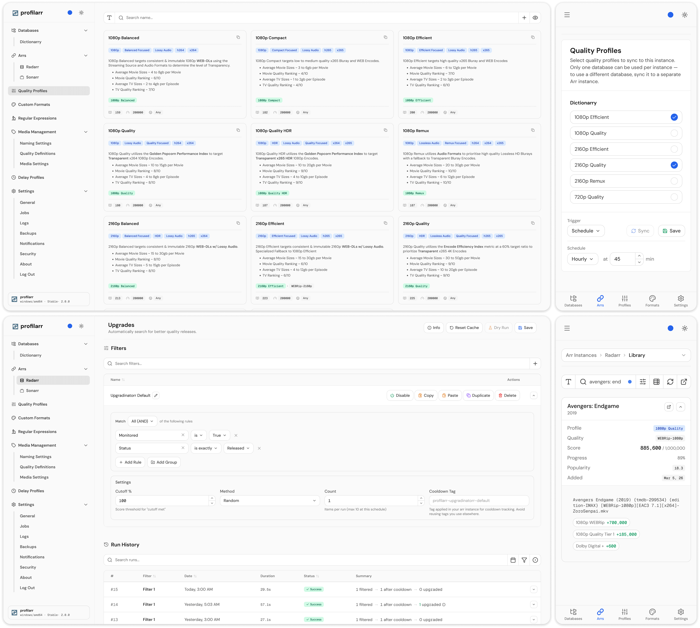

<br>

<p align="center">
  <picture>
    <source media="(prefers-color-scheme: dark)" srcset="src/lib/client/assets/banner-light.svg">
    <source media="(prefers-color-scheme: light)" srcset="src/lib/client/assets/banner-dark.svg">
    
  </picture>
</p>

<h3 align="center">Build, test, and deploy configurations across your media stack</h3>

<p align="center">
  <a href="https://github.com/Dictionarry-Hub/profilarr/actions/workflows/ci.yml"></a>
  <a href="https://github.com/Dictionarry-Hub/profilarr/releases"></a>
  <a href="https://github.com/Dictionarry-Hub/profilarr/blob/main/LICENSE"></a>
  <a href="https://discord.gg/2A89tXZMgA"></a>
  <a href="https://dictionarry.dev"></a>
</p>

<p align="center">
  <picture>
    <source media="(prefers-color-scheme: dark)" srcset="docs/assets/hero-dark.png">
    <source media="(prefers-color-scheme: light)" srcset="docs/assets/hero-light.png">
    
  </picture>
</p>

> [!WARNING]
> V2 is not yet ready for production use. It is currently in closed beta.
> For production use, see [Profilarr V1](https://github.com/Dictionarry-Hub/profilarr/tree/v1).
> Join our [Discord](https://discord.gg/2A89tXZMgA) if you'd like to beta test.

## 🌍 Overview

If you manage a media server, you've probably spent hours configuring quality
profiles, piecing together custom formats from forum posts, and hoping nothing
drifts between instances. Profilarr tries to make that easier.

## ✨ Features

### 🔨 Build

- **Link databases** - connect to curated databases like
  [Dictionarry](https://github.com/Dictionarry-Hub/database),
  [TRaSH Guides](https://github.com/Dictionarry-Hub/trash-pcd),
  or [Dumpstarr](https://github.com/Dumpstarr/Database)
- **Build your own** - create and share your own database using the
  [PCD template](https://github.com/Dictionarry-Hub/database-template)
- **Quality profiles** - group and order qualities, score custom formats per app
- **Custom formats** - match releases by resolution, source, release group,
  size, language, and more
- **Regular expressions** - reusable patterns shared across custom formats
- **Media management** - naming conventions, media settings, and quality
  definitions
- **Delay profiles** - protocol preferences, delays, and score gates
- **Local tweaks** - your changes persist across upstream updates with smart
  conflict handling

### 🧪 Test

- **Regular expressions** - validate patterns with embedded [Regex101](https://regex101.com/) test cases
- **Custom formats** - test releases against conditions with a full breakdown of
  how each passes or fails, with match visualization. Powered by a C# parser
  that matches Radarr and Sonarr's own parsing logic
- **Quality profiles** - simulate how a profile scores and ranks releases for a
  given movie or series

### 🚀 Deploy

- **Sync** - push configurations to any number of Arr instances
- **Upgrades** - automated searches with configurable filters, selectors, and
  cooldowns
- **Rename** - bulk rename files and folders with dry-run previews
- **Jobs** - scheduled automation for sync, upgrades, renames, backups, and
  cleanup
- **Notifications** - Discord, Telegram, Slack, ntfy, Pushover, Gotify, Apprise,
  and generic webhooks

## 📦 Getting Started

### Production

```yaml
services:
  profilarr:
    image: ghcr.io/dictionarry-hub/profilarr:latest
    container_name: profilarr
    ports:
      - '6868:6868'
    volumes:
      - ./config:/config
    environment:
      - PUID=1000
      - PGID=1000
      - TZ=Etc/UTC
      - PARSER_HOST=parser
      - PARSER_PORT=5000
    depends_on:
      parser:
        condition: service_healthy

  # Optional - only needed for CF/QP testing
  parser:
    image: ghcr.io/dictionarry-hub/profilarr-parser:latest
    container_name: profilarr-parser
    expose:
      - '5000'
```

> [!NOTE]
> The parser service is only required for custom format and quality profile
> testing. Linking, syncing, and all other features work without it. Remove the
> `parser` service and related environment variables if you don't need it.

| Variable      | Default     | Description                     |
| ------------- | ----------- | ------------------------------- |
| `PUID`        | `1000`      | User ID for file permissions    |
| `PGID`        | `1000`      | Group ID for file permissions   |
| `UMASK`       | `022`       | File creation mask              |
| `TZ`          | `Etc/UTC`   | Timezone for scheduling         |
| `PORT`        | `6868`      | Web UI port                     |
| `HOST`        | `0.0.0.0`   | Bind address                    |
| `AUTH`        | `on`        | Auth mode (`on`, `oidc`, `off`) |
| `PARSER_HOST` | `localhost` | Parser service host             |
| `PARSER_PORT` | `5000`      | Parser service port             |

See the [documentation](https://dictionarry.dev/) for full setup and
configuration guides.

### Development

**Prerequisites**

- [Git](https://git-scm.com/) (for PCD operations)
- [Deno](https://deno.com/) 2.x
- [.NET SDK](https://dotnet.microsoft.com/) 8.0+ (optional, for parser)

```bash
git clone https://github.com/Dictionarry-Hub/profilarr.git
cd profilarr
deno task dev
```

This runs the parser service and Vite dev server concurrently.

Contributions are welcome! For anything beyond small fixes, please open an
issue or reach out on [Discord](https://discord.gg/2A89tXZMgA) first so we
can discuss the approach. See [CONTRIBUTING.md](docs/CONTRIBUTING.md) for the
full development workflow.

## ❤️ Support

Every feature in Profilarr is free for everyone, and development will continue
with or without donations. If you'd like to show support, you can, but it's
in no way necessary.

- :coffee: [Buy Me A Coffee](https://www.buymeacoffee.com/santiagosayshey)
- :cat: [GitHub Sponsors](https://github.com/sponsors/Dictionarry-Hub)

## 🤝 License

[AGPL-3.0](LICENSE)

Profilarr is free and open source. You do not need to pay anyone to use it. If
someone is charging you for access to Profilarr, they are violating the spirit
of this project.
