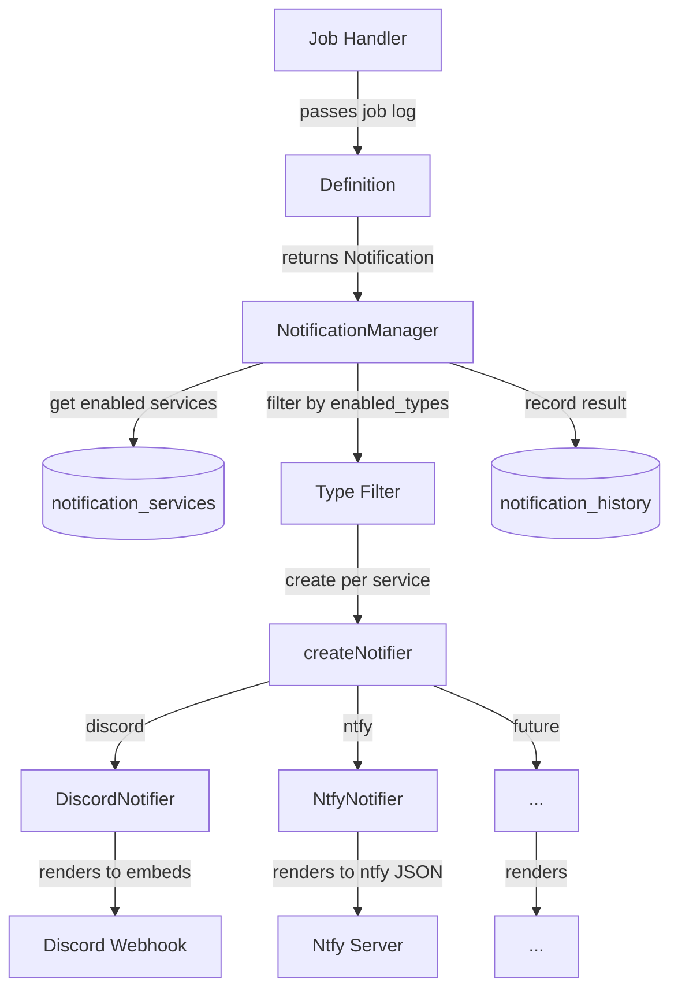

# Notification System

## Table of Contents

- [Overview](#overview)
- [Architecture](#architecture)
  - [Separation of Concerns](#separation-of-concerns)
  - [Data Flow](#data-flow)
  - [Fire-and-Forget](#fire-and-forget)
- [Notification Payload](#notification-payload)
  - [Design Rationale](#design-rationale)
  - [Severity](#severity)
  - [Blocks](#blocks)
- [Definitions](#definitions)
  - [What a Definition Does](#what-a-definition-does)
  - [What a Definition Doesn't Do](#what-a-definition-doesnt-do)
- [NotificationManager](#notificationmanager)
  - [Routing](#routing)
  - [Direct Send](#direct-send)
  - [History Recording](#history-recording)
- [Service Abstraction](#service-abstraction)
  - [Notifier Interface](#notifier-interface)
  - [BaseHttpNotifier](#basehttpnotifier)
  - [Rendering Responsibility](#rendering-responsibility)
- [Example: End-to-End Flow](#example-end-to-end-flow)
  - [1. The Event Happens](#1-the-event-happens)
  - [2. The Definition Structures It](#2-the-definition-structures-it)
  - [3. The Handler Sends It](#3-the-handler-sends-it)
  - [4. The Manager Routes It](#4-the-manager-routes-it)
  - [5. Each Notifier Renders It](#5-each-notifier-renders-it)
- [Testing](#testing)
  - [Running](#running)
  - [What Each Spec Covers](#what-each-spec-covers)
  - [Mock Webhook Server](#mock-webhook-server)
  - [Real Webhooks](#real-webhooks)

## Overview

Profilarr's notification system sends alerts when jobs complete, databases sync,
or things go wrong. Two design goals drive every decision:

1. **Extensibility without coupling.** Adding a new service (Ntfy, Slack,
   Telegram) or a new event (backup failed, PCD update available) is a
   self-contained change that doesn't touch unrelated code.
2. **Definitions don't know about services.** The code that decides _what to
   say_ about a rename never imports Discord embeds, Ntfy priorities, or Slack
   blocks. It produces a structured, service-agnostic payload. Each notifier
   decides _how to render_ that payload for its platform.

Notifications are **fire-and-forget**. A failed webhook never blocks a rename,
upgrade, or sync. Errors are logged and recorded in history, but never propagated
to the caller. A silently missed notification is preferable to an interrupted
job.

## Architecture

### Separation of Concerns

Three layers, each with a single job:

| Layer          | Responsibility                                                                     | Knows about                                    |
| -------------- | ---------------------------------------------------------------------------------- | ---------------------------------------------- |
| **Definition** | Decides _what to say_: title, message, blocks, severity                            | Domain data (job logs, statuses)               |
| **Manager**    | Decides _who to tell_: queries services, filters by type, records history          | Service configs, type subscriptions            |
| **Notifier**   | Decides _how to render_: maps the structured payload to a platform-specific format | Platform API (Discord embeds, Ntfy JSON, etc.) |

This means:

- Adding a new **service** never touches definitions. The notifier maps the
  existing structured payload to its platform.
- Adding a new **event** never touches notifiers. The definition produces the
  same payload shape that all notifiers already know how to render.
- The **manager** is the only routing code. No handler manually loops over
  services or instantiates notifiers.

### Data Flow



Single send path: the handler calls a definition, the definition returns a
`Notification`, the handler passes it to the manager via `send()`. The manager
handles everything from there. No bypass path, no direct notifier instantiation
from handlers.

The one exception is `sendToService(serviceId, notification)` on the manager,
used for test notifications that target a specific service and bypass the
`enabled_types` filter.

### Fire-and-Forget

Every layer swallows errors:

- `BaseHttpNotifier.notify()` catches and logs, never throws
- `NotificationManager.sendToService()` wraps everything in try/catch and
  records failure in history
- Job handlers wrap the `send()` call in try/catch

This redundancy is intentional. Each layer is independently safe. If the middle
layer loses its error handling during a refactor, the outer layers still prevent
job interruption.

## Notification Payload

```
src/lib/server/notifications/types.ts
```

```typescript
interface Notification {
	type: string;
	severity: 'success' | 'error' | 'warning' | 'info';
	title: string;
	message: string;
	blocks?: NotificationBlock[];
}

type NotificationBlock = FieldBlock | SectionBlock;

interface FieldBlock {
	kind: 'field';
	label: string;
	value: string;
	inline?: boolean;
}

interface SectionBlock {
	kind: 'section';
	title: string;
	content: string;
}
```

### Design Rationale

The payload is a **structured document**, not a rendering instruction. It
describes _what happened_ with enough structure for any service to produce useful
output, but without dictating _how_ it should look.

This avoids two failure modes:

1. **Too thin.** If the payload were just `{ title, message }`, services like
   Discord would get a plain text blob while being capable of rich embeds. The
   inevitable result is adding `discord?: DiscordEmbed[]` to the interface,
   coupling definitions to Discord.
2. **Too service-specific.** If the payload included Discord embed objects,
   every definition would import `EmbedBuilder` and every new service would have
   to either understand Discord embeds or settle for a thin fallback.

The structured payload sits in the middle. Blocks carry enough information for
Discord to build rich embeds, Ntfy to set priorities and format bodies, and a
generic webhook to forward the raw object, all from the same payload.

### Severity

`severity` replaces the old pattern of inferring colour from the type string
(`type.includes('success')` -> green). It's explicit, part of the payload, and
each notifier maps it to their platform's concept:

| Notifier | success              | error                | warning              | info                 |
| -------- | -------------------- | -------------------- | -------------------- | -------------------- |
| Discord  | Green embed          | Red embed            | Yellow embed         | Blue embed           |
| Ntfy     | Priority 3 (default) | Priority 5 (urgent)  | Priority 4 (high)    | Priority 3 (default) |
| Slack    | Green sidebar        | Red sidebar          | Yellow sidebar       | Blue sidebar         |
| Webhook  | Passed through as-is | Passed through as-is | Passed through as-is | Passed through as-is |

### Blocks

`blocks` is a single ordered array of content. Each block is a discriminated
union (`kind` field) with two variants:

**FieldBlock** - key-value pairs for structured metadata. Stats, counts, modes.
Small, often rendered inline:

```typescript
{ kind: 'field', label: 'Files', value: '5/5', inline: true }
```

**SectionBlock** - larger content blocks. Renamed files, upgrade details, error
lists. Each has a title and a content string:

```typescript
{ kind: 'section', title: 'Breaking Bad - Season 3', content: 'Before: S03E01.mkv\nAfter: ...' }
```

The single array matters because **ordering is meaningful**. A rename
notification reads top-to-bottom:

```typescript
blocks: [
	{ kind: 'field', label: 'Files', value: '5/5', inline: true },
	{ kind: 'field', label: 'Folders', value: '3', inline: true },
	{ kind: 'field', label: 'Mode', value: 'Live', inline: true },
	{ kind: 'section', title: 'Breaking Bad - Season 3', content: 'Before: ...\nAfter: ...' },
	{ kind: 'section', title: 'Breaking Bad - Season 4', content: 'Before: ...\nAfter: ...' },
	{ kind: 'field', label: 'Errors', value: 'Failed to rename 1 file' }
];
```

With separate `fields[]` and `sections[]` arrays, the "Errors" field would be
forced to render with the other fields at the top, away from the content it
relates to. A single array gives definitions full control over content order
without knowing how it will be rendered.

Notifiers walk the array in order. Discord adds fields and sections to the
current embed, starting a new embed when limits are hit. Ntfy formats each block
as text lines. Generic webhooks forward the array as-is.

The union is extensible. Adding a third block type (image, divider, table) means
adding a variant without changing the `Notification` shape or any existing
definitions.

## Definitions

```
src/lib/server/notifications/definitions/
```

### What a Definition Does

A definition takes domain data (a job log, an event payload) and returns a
`Notification` with structured content:

```typescript
export function rename(params: RenameNotificationParams): Notification {
	return {
		type: `rename.${log.status}`,
		severity: log.status === 'failed' ? 'error' : log.status === 'partial' ? 'warning' : 'success',
		title: `${prefix} Rename ${result} - ${log.instanceName}`,
		message: `Renamed ${log.results.filesRenamed} files for ${log.instanceName}`,
		blocks: [
			{ kind: 'field', label: 'Files', value: `${filesRenamed}/${filesNeeding}`, inline: true },
			{ kind: 'field', label: 'Mode', value: 'Live', inline: true },
			...buildSections(log) // Grouped by item/season
		]
	};
}
```

Definitions handle:

- Deciding the severity from the job status
- Formatting the title and summary message
- Building blocks in meaningful order (stats first, then content, then errors)
- Grouping content into sections (e.g., Sonarr files by season)

### What a Definition Doesn't Do

- Import anything from `notifiers/`. No `EmbedBuilder`, no `Colors`, no
  service-specific types.
- Decide how content is rendered. No code blocks, no colour codes, no field
  truncation.
- Know which services exist. The same payload goes to Discord, Ntfy, or anything
  else.

## NotificationManager

```
src/lib/server/notifications/NotificationManager.ts
```

The manager is the **only** way notifications get sent. No handler instantiates a
notifier directly.

### Routing

On `notify(notification)`:

1. Query `notification_services` for all enabled services
2. Filter to services whose `enabled_types` JSON array includes the
   notification's type
3. For each matching service, `createNotifier()` builds the right notifier class
   from `service_type` + `config` JSON
4. Send in parallel via `Promise.allSettled()` (one failure doesn't block others)
5. Record success/failure in history for each service

The `createNotifier` factory is a simple switch on `service_type`:

```typescript
switch (serviceType) {
	case 'discord':
		return new DiscordNotifier(config);
	case 'ntfy':
		return new NtfyNotifier(config);
	default:
		return null;
}
```

Adding a new service means adding a case here plus the corresponding config type
import.

### Direct Send

`sendToService(serviceId, notification)` sends to a specific service, bypassing
the `enabled_types` filter. Used for test notifications from the UI, where the
user clicks "Test" on a specific service and expects it to fire regardless of
which types are enabled.

Still goes through the manager (history recording, notifier creation). Only the
type filter is skipped.

### History Recording

Every send attempt is recorded in `notification_history`, regardless of success
or failure. The `finally` block in `sendToService()` ensures history is written
even if the notifier throws unexpectedly. Failed sends include the error message.

History is used for:

- Service stats in the UI (success count, failure count, success rate)
- Recent notification log (last 50)
- Debugging delivery issues

History is queryable by service, type, status, and date range. Old entries can be
pruned via `deleteOlderThan(days)`.

## Service Abstraction

### Notifier Interface

```
src/lib/server/notifications/base/Notifier.ts
```

Two methods, deliberately minimal:

```typescript
interface Notifier {
	notify(notification: Notification): Promise<void>;
	getName(): string;
}
```

`getName()` exists purely for log messages. `notify()` receives the structured
`Notification` and is responsible for rendering it into the service's native
format and sending it.

### BaseHttpNotifier

```
src/lib/server/notifications/base/BaseHttpNotifier.ts
```

Abstract base for webhook-based services. Provides:

- **Rate limiting**: 1-second minimum between sends. If a burst of notifications
  arrives (e.g., multiple arr instances finishing sync simultaneously), later ones
  are dropped with a warning log. This prevents webhook endpoint abuse. Discord's
  rate limit is 30 requests per 60 seconds per webhook; the 1-second floor keeps
  well under that.
- **Shared HTTP client**: Uses `WebhookClient` (a `BaseHttpClient` with 10s
  timeout, no retries). Connection pooling is shared across all notifications.
  No retries because webhooks should either work or not. Retrying a malformed
  payload or expired URL wastes time.

Subclasses implement three methods:

| Method            | Purpose                                          |
| ----------------- | ------------------------------------------------ |
| `getWebhookUrl()` | Return the target URL from config                |
| `formatPayload()` | Render `Notification` into service-specific JSON |
| `getName()`       | Service name for logging                         |

### Rendering Responsibility

Each notifier owns the full rendering pipeline for its service. Given the
structured `Notification`, the notifier decides:

- How to map `severity` to a visual indicator (colour, priority, emoji)
- How to render each block kind (fields as embed fields or key-value lines,
  sections as code blocks or plain text)
- How to handle content that exceeds platform limits (pagination, truncation)
- What chrome to add (author lines, footers, timestamps, mentions)

All platform-specific knowledge lives in one place per service. The rename
definition does not need to know that Discord has a 6000-character embed limit or
that Ntfy supports markdown in the message body.

## Example: End-to-End Flow

A backup job completes successfully. Two notification services are configured: a
Discord webhook and an Ntfy topic. Both subscribe to
`job.create_backup.success`.

### 1. The Event Happens

The backup handler finishes creating a backup. It has a log object with the
filename, size, and duration:

```typescript
const log = {
	status: 'success',
	filename: 'profilarr-2026-03-17.zip',
	sizeBytes: 4_200_000,
	durationMs: 1200
};
```

### 2. The Definition Structures It

The handler calls the backup definition, which knows nothing about Discord or
Ntfy. It turns a backup log into a `Notification`:

```typescript
// definitions/backup.ts
export function backup(log: BackupJobLog): Notification {
	const sizeMb = (log.sizeBytes / 1_000_000).toFixed(1);
	const durationSec = (log.durationMs / 1000).toFixed(1);

	return {
		type: `job.create_backup.${log.status}`,
		severity: 'success',
		title: 'Backup Complete',
		message: `Created ${log.filename} (${sizeMb} MB)`,
		blocks: [
			{ kind: 'field', label: 'Filename', value: log.filename, inline: true },
			{ kind: 'field', label: 'Size', value: `${sizeMb} MB`, inline: true },
			{ kind: 'field', label: 'Duration', value: `${durationSec}s`, inline: true }
		]
	};
}
```

The output is a plain data object:

```typescript
{
  type: 'job.create_backup.success',
  severity: 'success',
  title: 'Backup Complete',
  message: 'Created profilarr-2026-03-17.zip (4.2 MB)',
  blocks: [
    { kind: 'field', label: 'Filename', value: 'profilarr-2026-03-17.zip', inline: true },
    { kind: 'field', label: 'Size', value: '4.2 MB', inline: true },
    { kind: 'field', label: 'Duration', value: '1.2s', inline: true },
  ]
}
```

### 3. The Handler Sends It

The backup handler passes the notification to the manager. One line:

```typescript
try {
	await notificationManager.notify(notifications.backup(log));
} catch {
	// fire-and-forget
}
```

The handler does not know or care which services are configured.

### 4. The Manager Routes It

The manager queries the database and finds two enabled services that subscribe to
`job.create_backup.success`:

| Service      | Type    |
| ------------ | ------- |
| Main Discord | discord |
| Phone Alerts | ntfy    |

It creates a `DiscordNotifier` and an `NtfyNotifier` from their respective
configs, sends in parallel via `Promise.allSettled()`, and records both results
in `notification_history`.

### 5. Each Notifier Renders It

The same `Notification` object arrives at both notifiers. Each renders it for
their platform:

**Discord** builds an embed:

```json
{
	"username": "Profilarr",
	"embeds": [
		{
			"title": "Backup Complete",
			"color": 65280,
			"fields": [
				{ "name": "Filename", "value": "profilarr-2026-03-17.zip", "inline": true },
				{ "name": "Size", "value": "4.2 MB", "inline": true },
				{ "name": "Duration", "value": "1.2s", "inline": true }
			],
			"footer": { "text": "Type: job.create_backup.success" },
			"timestamp": "2026-03-17T12:00:00.000Z"
		}
	]
}
```

**Ntfy** builds a simple notification:

```json
{
	"topic": "profilarr",
	"title": "Backup Complete",
	"message": "Created profilarr-2026-03-17.zip (4.2 MB)\n\nFilename: profilarr-2026-03-17.zip\nSize: 4.2 MB\nDuration: 1.2s",
	"priority": 3
}
```

Same notification, two completely different outputs. Neither notifier knows about
the other, and the definition that produced the notification knows about neither.

## Testing

```
tests/integration/notifications/
  harness/
    mock-server.ts       - Deno.serve() that captures HTTP requests
  specs/
    test.test.ts         - test notification (definition + Discord + real webhook)
    upgrade.test.ts      - upgrade notification (definition + Discord + real webhook)
    rename.test.ts       - rename notification (definition + Discord + real webhook)
```

Tests are organized by notification type, not by layer. Each spec covers the
full pipeline for that type: definition output, Discord rendering via a mock
webhook server, and optionally a real webhook send.

No full Profilarr server is needed. Definitions are pure functions. Discord
rendering is tested by instantiating `DiscordNotifier` pointed at a mock server
and asserting on the captured HTTP payloads.

### Running

```bash
deno task test integration notifications              # all
deno task test integration notifications test         # test notification only
deno task test integration notifications upgrade      # upgrade only
deno task test integration notifications rename       # rename only
```

### What Each Spec Covers

**Definition tests** (always run):

- Type string includes the correct status
- Severity maps from status (success/error/warning/info)
- Title includes instance name, manual/automatic prefix
- Stats section contains expected values (filter, selector, funnel)
- Item sections carry imageUrl from arr API
- Sonarr groups by season in content
- Edge cases (no items, dry run, errors)

**Discord rendering tests** (always run, uses mock server):

- Severity maps to correct embed color
- Item embeds have poster thumbnails
- Item embed titles match movie/series names
- Failed status uses error color
- Fields, sections, and pagination render correctly

**Real webhook tests** (skipped without `.env`):

- Sends actual notifications to Discord for visual verification
- Covers Radarr movies, Sonarr series with seasons, folder renames

### Mock Webhook Server

`tests/integration/notifications/harness/mock-server.ts` provides a
`Deno.serve()` instance that captures all incoming requests and returns JSON
responses. Configurable response status for error path testing.

```typescript
const { captured, server } = createMockServer(MOCK_PORT);

const notifier = new DiscordNotifier({
	webhook_url: `http://localhost:${MOCK_PORT}/webhook`,
	username: 'TestBot'
});
await notifier.notify(notification);

assertEquals(captured.length, 1);
assertEquals(captured[0].body.embeds[0].title, 'Expected Title');
```

### Real Webhooks

Copy `.env.example` to `.env` in `tests/integration/notifications/`:

```env
TEST_DISCORD_WEBHOOK=https://discord.com/api/webhooks/...
```

Real webhook tests check for the env var and skip if absent. They send actual
notifications to Discord for visual verification after writing or modifying a
notifier. Not part of CI.
