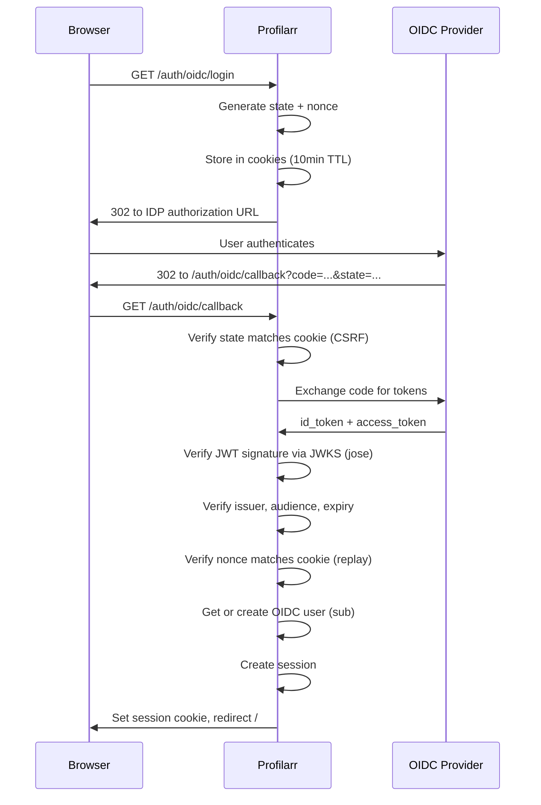
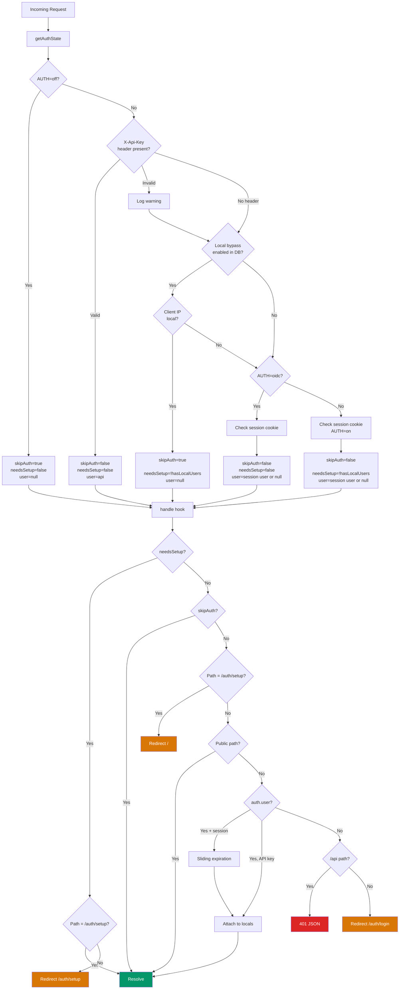

# Auth System

## Table of Contents

- [Overview](#overview)
- [Auth Modes](#auth-modes)
  - [AUTH=on](#authon-default)
  - [AUTH=oidc](#authoidc)
  - [AUTH=off](#authoff)
  - [Local Bypass](#local-bypass)
  - [API Key](#api-key)
- [Request Flow](#request-flow)
- [Security Features](#security-features)
  - [Hashing](#hashing)
  - [Rate Limiting](#rate-limiting)
  - [CSRF & Reverse Proxies](#csrf--reverse-proxies)
  - [Protected Paths](#protected-paths)
  - [Secret Stripping](#secret-stripping)
  - [XSS via Markdown / {@html}](#xss-via-markdown--html)
  - [Path Traversal](#path-traversal)
- [Test Coverage](#test-coverage)
  - [Unit Tests](#unit-tests-srctestsauth)
  - [Integration Tests](#integration-tests-srctestsintegrationspecs)
  - [E2E Tests](#e2e-tests-srctestse2especsauth)
  - [Security Scans](#security-scans)
    - [SAST - Semgrep](#sast--semgrep)
    - [DAST - OWASP ZAP](#dast--owasp-zap)
  - [Infrastructure](#infrastructure)

## Overview

### Why security matters

Profilarr stores credentials for connected services: arr API keys, GitHub PATs,
AI API keys, TMDB keys, and notification webhooks.

The arr keys are the biggest risk. Sonarr/Radarr store indexer and tracker API
keys internally - exposing an arr API key gives access to the arr's full API,
which can retrieve all configured indexer credentials.

Ideally Profilarr never touches the open internet. Users should be connecting
via a VPN, Tailscale, or sitting behind an authenticating reverse proxy. The
built-in auth exists as a safety net - if someone does expose it, they're not
immediately wide open. As Seraphys (Dictionarry's Database Maintainer) likes to
say - It's _stupidity mitigation_. Patent Pending.

### Defence in depth

1. **Authentication** - gate access via username/password, OIDC, or API key.
   Enforced by `getAuthState()` in middleware and `handle()` in the server hook.
2. **Data exposure controls** - authenticated users never see raw secrets. The
   frontend receives boolean flags (`hasApiKey`, `hasPat`) instead of actual
   values. Secrets are also stripped from backup downloads.
3. **Filesystem is the trust boundary** - encrypting secrets at rest would be
   theatre since the decryption key would also be on disk. Filesystem security
   (containers, unprivileged users, volume permissions) is the user's
   responsibility.

## Auth Modes

Set via `AUTH` env var. All modes except `off` also support API key auth via
`X-Api-Key` header and an optional local bypass toggle.

| Variable             | Default | Description                                           | Example                                                      |
| -------------------- | ------- | ----------------------------------------------------- | ------------------------------------------------------------ |
| `AUTH`               | `on`    | Auth mode: `on`, `off`, `oidc`                        | `oidc`                                                       |
| `ORIGIN`             | -       | Scheme + host for reverse proxy (CSRF, cookies, OIDC) | `https://profilarr.mydomain.com`                             |
| `OIDC_DISCOVERY_URL` | -       | OIDC provider discovery endpoint (AUTH=oidc only)     | `https://auth.mydomain.com/.well-known/openid-configuration` |
| `OIDC_CLIENT_ID`     | -       | OIDC client ID (AUTH=oidc only)                       | `profilarr`                                                  |
| `OIDC_CLIENT_SECRET` | -       | OIDC client secret (AUTH=oidc only)                   | `your-secret`                                                |

### AUTH=on (default)

Username/password login with session-based auth. On first run, the user is
redirected to `/auth/setup` to create an admin account. Passwords are
bcrypt-hashed. Sessions default to 7 days with sliding expiration - matching
Sonarr's approach (ASP.NET's `SlidingExpiration`), which re-issues when more
than halfway through the expiration window. Sonarr uses ASP.NET's built-in
cookie middleware for this; we implement it manually against SQLite in
`maybeExtendSession()`.

#### Sessions

Stored in the `sessions` table with metadata: IP, user agent, browser, OS,
device type, last active. Duration is configured in
`auth_settings.session_duration_hours` (default 7 days). Sliding expiration
extends the session when less than half the duration remains. Expired sessions
are cleaned up on startup. Users can view active sessions, revoke individual
sessions, or revoke all others via Settings > Security.

Cookie properties:

| Property   | Value                                       |
| ---------- | ------------------------------------------- |
| `httpOnly` | `true`                                      |
| `sameSite` | `lax`                                       |
| `secure`   | `true` when `ORIGIN` starts with `https://` |
| `path`     | `/`                                         |

### AUTH=oidc

Delegates authentication to an external OIDC provider (Authentik, Keycloak,
Google, etc.). The login page shows a "Sign in with SSO" button instead of a
password form. The flow uses state cookies for CSRF protection, nonce cookies
for token replay prevention, and verifies JWT signatures via the provider's JWKS
endpoint using the `jose` library. OIDC users are stored with an `oidc:`
username prefix. Sessions work the same as AUTH=on.



### AUTH=off

No auth checks. All requests are allowed through. Intended for deployments
behind an authenticating reverse proxy like Authelia or Authentik. The setup
page is blocked in this mode since there's no local user to create.

### Local Bypass

Separate from auth modes - a DB-backed toggle in
`auth_settings.local_bypass_enabled`, managed via Settings > Security. Works
alongside `on` and `oidc` modes.

When enabled, requests from local network IPs skip auth entirely. If no local
user exists yet, the setup flow is still enforced. Based on Sonarr's
`DisabledForLocalAddresses` auth type, which uses the same approach - check the
remote IP against private ranges and bypass auth if it matches (see
`IpAddressExtensions.cs` and `UiAuthorizationHandler.cs` in Sonarr's source).

Recognised local ranges: `127.0.0.0/8`, `10.0.0.0/8`, `172.16.0.0/12`,
`192.168.0.0/16`, `169.254.0.0/16` (IPv4), `::1`, `fe80::/10`, `fc00::/7`,
`fec0::/10` (IPv6). IPv6-mapped IPv4 addresses (`::ffff:192.168.x.x`) are also
handled. Unlike Sonarr, we don't currently support CGNAT (`100.64.0.0/10`).

### API Key

Available in all modes except `AUTH=off`. Checked before local bypass and
session checks in the request flow.

- Header: `X-Api-Key`
- Scoped to `/api/` paths only. Browser pages and SvelteKit form actions require
  a real session. Requests with a valid API key to non-API paths get 403. This
  prevents the API key from being used as a second admin login (e.g.
  regenerating its own key or toggling local bypass via settings form actions).
  When `/api/internal/` routes exist, API key auth will be excluded from those
  too.
- Key is bcrypt-hashed in the database - never stored as plaintext
- `regenerateApiKey()` returns the plaintext key once for the user to copy; only
  the hash is persisted
- Validation uses async bcrypt `verify()` against the stored hash
- Invalid keys are logged with a masked value (`****` + last 4 chars)

## Request Flow



## Security Features

### Hashing

Passwords and the Profilarr API key are both bcrypt-hashed. Passwords are hashed
at account creation and password change. The API key is hashed at generation
time (migration 057 cleared any legacy plaintext keys); `regenerateApiKey()`
returns the plaintext once for the user to copy, then only the hash is
persisted. Validation uses async bcrypt `verify()` in both cases.

This differs from most apps in the arr ecosystem. Sonarr, Radarr, and similar
tools store their API keys as plaintext in the database and always display them
to authenticated users in settings. Profilarr treats the API key more like a
password - hashed on storage, shown once at generation, never retrievable
afterward. This is closer to how services like GitHub and Stripe handle API
keys.

### Rate Limiting

Login endpoint (`/auth/login`) has SQLite-backed rate limiting with a 15-minute
window. Failed attempts are categorized to apply different thresholds:

| Category     | Threshold | Trigger                                                        |
| ------------ | --------- | -------------------------------------------------------------- |
| `suspicious` | 3         | Common attack usernames (admin, root, test, guest, etc.)       |
| `typo`       | 10        | Wrong password for existing user, or Levenshtein distance <= 2 |
| `unknown`    | 10        | Everything else                                                |

Rate limit state is stored in SQLite rather than in-memory. An in-memory counter
resets on process restart - if an attacker can trigger repeated crashes (and the
process manager auto-restarts), they can brute-force credentials by resetting
the rate limit with each crash. SQLite persistence survives restarts, so
accumulated attempts are never lost.

Attempts are cleared on successful login and expired attempts are cleaned up on
startup.

Rate limiting uses the real TCP connection address
(`getClientIp(event, false)`), not proxy headers. This prevents an attacker from
bypassing the rate limit by rotating `X-Forwarded-For` values with each request.
Session metadata (the IP shown in the active sessions list) still uses proxy
headers so users behind a reverse proxy see the correct client IP for display
purposes.

### CSRF & Reverse Proxies

SvelteKit's CSRF check compares the `Origin` request header against
`new URL(request.url).origin`. The official `@sveltejs/adapter-node` rewrites
`request.url` using the `ORIGIN` env var, so this works behind reverse proxies.

The Deno adapter (`sveltekit-adapter-deno`) does **not** do this. It passes
`request.url` straight from `Deno.serve`, which is always the internal server
URL (e.g. `http://localhost:6868`). Behind a reverse proxy:

```
Browser: POST /auth/login
  Origin: https://profilarr.mydomain.com     <- from address bar

SvelteKit sees:
  request.url.origin = http://localhost:6868  <- actual server URL
  Origin header      = https://profilarr.mydomain.com

Mismatch -> 403 "Cross-site POST form submissions are forbidden"
```

**The fix** (`src/adapter/files/mod.ts`): rewrites `request.url` when `ORIGIN`
is set, matching `adapter-node` behaviour:

```ts
let req = request;
const origin = Deno.env.get('ORIGIN');
if (origin) {
	const url = new URL(request.url);
	req = new Request(`${origin}${url.pathname}${url.search}`, request);
}
return server.respond(req, { getClientAddress: () => clientAddress });
```

Notes:

- `adapter-node` isn't an option - it outputs JS for Node.js. Profilarr compiles
  to a single Deno binary via `deno compile`.
- `csrf.trustedOrigins` isn't an option - it's build-time config in
  `svelte.config.js`, so users can't set their own domain at deploy time.

### Protected Paths

Every route is protected by default - the server hook rejects unauthenticated
requests unless the path is explicitly allowlisted in `publicPaths.ts`. This is
the first line of defence and needs to be airtight: a missing entry redirects to
login, but an overly broad allowlist exposes protected pages to the internet.
New public paths must be added deliberately with a clear reason.

The current public allowlist:

| Path                  | Why public                                        |
| --------------------- | ------------------------------------------------- |
| `/auth/setup`         | First-run setup - no credentials exist yet        |
| `/auth/login`         | Must be reachable to authenticate                 |
| `/auth/oidc/login`    | Initiates redirect to external OIDC provider      |
| `/auth/oidc/callback` | Provider redirects back here after authentication |
| `/api/v1/health`      | Uptime monitors need this without credentials     |

Everything else requires a valid session, API key, or local bypass.
`/auth/logout` is not public - it requires an existing session to clear.

Page-level guards add further restrictions on top:

- `/auth/setup` redirects to `/` if AUTH=off or a local user already exists
- `/auth/login` redirects to `/auth/setup` if no local users exist (AUTH=on), or
  shows SSO button (AUTH=oidc)

### Secret Stripping

Secrets are stripped at two levels:

- **Frontend responses** - server-side load functions replace sensitive fields
  with boolean flags (`hasApiKey`, `hasPat`). Webhook URLs are omitted from
  notification config. Password hashes never leave the server.
- **Backup downloads** - the DB copy inside the archive has all secrets nulled
  (`arr_instances.api_key`, `database_instances.personal_access_token`,
  `auth_settings.api_key`, `ai_settings.api_key`, `tmdb_settings.api_key`),
  notification configs cleared, and auth tables (`users`, `sessions`,
  `login_attempts`) emptied. The production database is never touched.

### XSS via Markdown / {@html}

Svelte's `{@html}` directive renders raw HTML without escaping. Any content that
flows through `{@html}` without sanitisation is an XSS vector.

**The attack**: Profilarr clones PCD databases maintained by community
developers. These databases contain markdown fields - quality profile
descriptions, custom format descriptions, etc. A malicious or compromised
developer could inject JavaScript into a description field:

```markdown
Great profile for 1080p

<!--  -->
```

Every user who clones that database would execute the payload whenever the
description renders. The attacker could steal session cookies, exfiltrate API
keys displayed on the page, or redirect to a phishing page - all without needing
to authenticate.

**Mitigation**: The `Markdown.svelte` component (the primary markdown renderer)
passes all `marked.parse()` output through `sanitizeHtml()` from
`$shared/utils/sanitize.ts` before rendering with `{@html}`. The sanitizer
strips `<script>` tags, event handlers (`onerror`, `onclick`, etc.), and any
tags/attributes not on an explicit allowlist. URL attributes (`href`, `src`) are
decoded (HTML entities, whitespace) and validated against a protocol allowlist
(`http:`, `https:`, `mailto:`) before being emitted, which prevents
entity-encoded (`jav&#x61;script:`) and whitespace-obfuscated (`java\nscript:`)
bypass variants.

The same `sanitizeHtml()` function is used server-side in
`$utils/markdown/markdown.ts` for any markdown rendered in load functions.

**Semgrep enforcement**: Custom rules in `tests/scan/semgrep/xss.yml` flag any
use of `marked.parse()` in Svelte files and any raw variable in `{@html}`,
ensuring new code is reviewed for sanitisation. Because Semgrep uses regex
matching for Svelte (no AST support), it cannot verify that sanitisation wraps
the call - verified-safe instances use `nosemgrep` comments with justification.

### Path Traversal

Several endpoints accept client-supplied file paths (for selective commits,
previews, and AI commit message generation). Without validation, an attacker
with a valid session or API key could use `../../` sequences or absolute paths
to escape the repository boundary and read or copy arbitrary files.

**The attack**: An authenticated user sends a POST to
`/api/databases/[id]/generate-commit-message` with
`{ "files": ["../../etc/passwd"] }`. The server resolves this relative to the
database's `local_path`, reads the file content via `Deno.readTextFile`, and
sends it to the configured AI provider. The attacker exfiltrates arbitrary
server files through the AI proxy. The commit and preview endpoints have similar
vectors via `Deno.copyFile` and `getDiff()`.

A subtler variant uses symlinks. A malicious PCD database maintainer commits a
symlink (`evil -> /etc`) into their repo. Git tracks symlinks as blob entries,
so it survives clone. A path like `evil/passwd` passes a naive lexical check (it
resolves inside the repo directory) but follows the symlink to `/etc/passwd`
when the filesystem actually reads it.

**Mitigation**: `validateFilePaths()` in `$utils/paths.ts` checks every
client-supplied path before any filesystem operation:

1. Rejects absolute paths (`/etc/passwd`)
2. Resolves relative paths against the repo root and verifies the result stays
   within the boundary (lexical `startsWith` check)
3. Follows symlinks via `Deno.realPathSync()` and verifies the real path is
   still within the boundary (catches symlink escapes)

**Known limitation**: The boundary check uses POSIX path separators (`/`). If
Windows becomes a supported deployment target, this will need to handle
backslash-separated paths from `resolve()` on Windows.

Validation is applied at three layers:

- **Route handlers** (`+server.ts`, `+page.server.ts`) - early reject with HTTP
  400 before any work begins
- **Exporter functions** (`previewDraftOps`, `exportDraftOps`) - defense in
  depth before clone/copy operations
- **`getDiff()`** - defense in depth so any future callers are also protected

## Test Coverage

### Unit Tests (`tests/unit/auth/`)

Pure function tests for the core auth utilities - IP classification, path
allowlisting, and login failure analysis. No server instances or network calls
needed.

| File                    | Tests                                                                                    |
| ----------------------- | ---------------------------------------------------------------------------------------- |
| `network.test.ts`       | IPv4/IPv6 local classification, boundary addresses, `getClientIp` with trustProxy on/off |
| `publicPaths.test.ts`   | Public vs protected path matching, prefix vs exact, no overly broad allowlist entries    |
| `loginAnalysis.test.ts` | Attack username detection, Levenshtein typo matching (1-2 edits), failure categorization |

**Sanitize tests** (`tests/unit/sanitize/`):

| File               | Tests                                                                                        |
| ------------------ | -------------------------------------------------------------------------------------------- |
| `sanitize.test.ts` | Entity-encoded/case-varied/whitespace-obfuscated javascript: bypass, allowed/disallowed tags |

### Integration Tests (`tests/integration/auth/specs/`)

Each spec boots an isolated server instance and tests a specific auth behaviour
end-to-end over HTTP. Uses a custom test harness with `TestClient` (cookie jar),
`ServerManager`, and Docker Compose for OIDC/TLS scenarios. Specs auto-discover
and run in parallel via `deno task test integration`.

| File                     | Port             | Tests                                                                                          |
| ------------------------ | ---------------- | ---------------------------------------------------------------------------------------------- |
| `health.test.ts`         | 7001             | Public health vs authenticated diagnostics, no info disclosure                                 |
| `csrf.test.ts`           | 7002, 7012, 7014 | Origin checking, no-origin fallback, reverse proxy CSRF with adapter rewrite                   |
| `cookie.test.ts`         | 7003, 7013       | Secure flag (HTTPS vs HTTP), httpOnly, SameSite, path, expiration                              |
| `apiKey.test.ts`         | 7004             | Valid/invalid key, header-only, 401 on missing, 403 for non-API paths                          |
| `session.test.ts`        | 7005             | Redirect flow, expiration, sliding expiration halfway extend, 401 JSON, logout CSRF protection |
| `oidc.test.ts`           | 7006, 7009, 7010 | Full OIDC flow, state/nonce tampering, AUTH=on rejection, proxy flow                           |
| `rateLimit.test.ts`      | 7007             | Suspicious/typo thresholds, successful login clears, window expiry                             |
| `proxy.test.ts`          | 7008             | Full flow through Caddy TLS, X-Forwarded-For recording, CSRF through proxy                     |
| `xForwardedFor.test.ts`  | 7015             | Spoofed header limited to session metadata; local bypass and login throttling use real TCP     |
| `secretExposure.test.ts` | 7016             | 16 page checks - no raw secrets in frontend responses (assumes stolen session)                 |
| `backupSecrets.test.ts`  | 7017             | 9 checks - backup DB copy has all secrets stripped, auth tables emptied                        |
| `pathTraversal.test.ts`  | 7018             | 15 checks - ../ , absolute path, and symlink escape rejection across 3 endpoints               |

### E2E Tests (`tests/e2e/auth/`)

Browser-level Playwright tests that drive the real user experience. Uses
`deno task test e2e auth` with Docker Compose (mock-oauth2-server + Caddy).

| File           | Tests                                                          |
| -------------- | -------------------------------------------------------------- |
| `oidc.spec.ts` | Full OIDC login flow in browser, both direct and through proxy |

### Security Scans (`tests/scan/`)

Security scans run via the test runner. Semgrep is intended to run in CI/CD as a
blocking check. ZAP is manual-only, run periodically for spot checks.

#### SAST - Semgrep

Static Application Security Testing. Scans source code for vulnerabilities
without running the application.

```bash
deno task test semgrep          # full scan: custom rules + community rulesets
deno task test semgrep --quick  # custom rules only (faster, for iteration)
```

The full scan uses `--error` so it exits non-zero on any finding. The goal is
zero findings - any unresolved finding is either a real bug to fix or a false
positive to suppress with a justification comment.

**Community rulesets** (from Semgrep Registry):

- `p/default`, `p/owasp-top-ten`, `p/security-audit` (general security)
- `p/typescript`, `p/javascript`, `p/nodejs` (language-specific)
- `p/csharp` (for the C# parser service)

**Custom rulesets** (`tests/scan/semgrep/`):

| File          | What it catches                                                                   |
| ------------- | --------------------------------------------------------------------------------- |
| `xss.yml`     | `{@html}` without sanitisation, `marked.parse()` in Svelte, unescaped table cells |
| `sql.yml`     | Template literal interpolation in SQL (exempts known-safe patterns)               |
| `secrets.yml` | Sensitive field names in logger metadata                                          |
| `deno.yml`    | Deno-specific patterns (file I/O review)                                          |
| `csharp.yml`  | C# parser service patterns (file I/O review)                                      |

**Suppressing false positives**: Use `nosemgrep` with the full rule ID and a
justification. The comment must be on the matched line or the line immediately
before it. Semgrep ignores comments separated by intervening lines.

```ts
// nosemgrep: profilarr.xss.table-cell-html-unescaped - all values use escapeHtml()
html: `<div>${escapeHtml(row.name)}</div>`;
```

For Svelte templates where JS comments aren't valid, use an HTML comment on the
same line as the `{@html}`:

```svelte
{@html parseMarkdown(text)}<!-- nosemgrep: profilarr.xss.at-html-usage -->
```

**Limitations**:

- Community rules are free-tier only (no cross-file taint analysis)
- Svelte files use generic/regex matching, not AST. Rules can't trace data flow
  through function calls, so sanitised-but-flagged code needs `nosemgrep`
- No dependency vulnerability scanning (Semgrep Supply Chain requires login)

#### DAST - OWASP ZAP

Dynamic Application Security Testing. Runs a live scan against compiled
Profilarr instances to find runtime vulnerabilities (missing headers, cookie
issues, information disclosure, etc.). Requires `deno task build` and Docker.

```bash
deno task test zap --baseline  # passive scan (spider + check responses)
deno task test zap --full      # passive + active attacks (SQLi, XSS, etc.)
deno task test zap --api       # API scan against OpenAPI spec (not yet implemented)
```

Each mode starts two servers and runs ZAP against both:

| Port | Config   | Purpose                                       |
| ---- | -------- | --------------------------------------------- |
| 7090 | AUTH=on  | Unauthenticated - tests what an outsider sees |
| 7091 | AUTH=off | Full crawl - ZAP can reach all routes         |

The `--api` mode will scan the OpenAPI spec once the API overhaul lands (see
`docs/todo/api-overhaul.md`). Uses the `-I` flag so warnings don't fail the
scan - only errors do.

### Infrastructure

- **Test harness**: custom runner, `TestClient` with cookie jar, `ServerManager`
  for isolated instances
- **Docker Compose**: mock-oauth2-server (port 9090) + Caddy (TLS termination)
  for OIDC and proxy tests
- **Runner**: `tests/runner.ts` - unified CLI (`deno task test`) handles unit,
  integration, e2e, and security scans with subcommands
