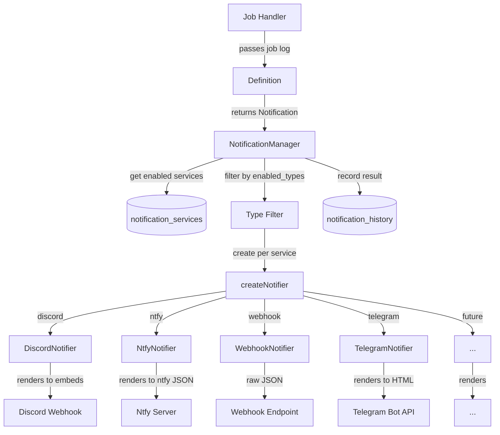

# Notification System

## Table of Contents

- [Overview](#overview)
- [Architecture](#architecture)
- [Notification Payload](#notification-payload)
  - [Severity](#severity)
- [Definitions](#definitions)
- [NotificationManager](#notificationmanager)
- [Notifiers](#notifiers)
  - [Discord (Detail Tier)](#discord-detail-tier)
  - [Ntfy (Summary Tier)](#ntfy-summary-tier)
  - [Webhook (Passthrough Tier)](#webhook-passthrough-tier)
  - [Telegram (Summary Tier)](#telegram-summary-tier)
- [Service Tiers](#service-tiers)
- [Testing](#testing)
- [Adding a New Service](#adding-a-new-service)

## Overview

Profilarr's notification system sends alerts when jobs complete, databases sync,
or things go wrong. Two design goals:

1. **Extensibility without coupling.** Adding a new service or event is a
   self-contained change that doesn't touch unrelated code.
2. **Definitions don't know about services.** The code that decides _what to
   say_ produces a structured, service-agnostic payload. Each notifier decides
   _how to render_ it.

Notifications are **fire-and-forget**. A failed webhook never blocks a job.
Errors are logged and recorded in history, never propagated.

## Architecture

Three layers:

| Layer          | Responsibility                                           | Knows about                         |
| -------------- | -------------------------------------------------------- | ----------------------------------- |
| **Definition** | Decides _what to say_: title, message, blocks, severity  | Domain data (job logs, statuses)    |
| **Manager**    | Decides _who to tell_: queries services, filters by type | Service configs, type subscriptions |
| **Notifier**   | Decides _how to render_: maps payload to platform format | Platform API (embeds, JSON, etc.)   |

Adding a new **service** never touches definitions. Adding a new **event** never
touches notifiers.



## Notification Payload

```
src/lib/server/notifications/types.ts
```

```typescript
interface Notification {
	type: string;
	severity: 'success' | 'error' | 'warning' | 'info';
	title: string;
	message: string;
	messageFormat?: 'plain' | 'code';
	blocks?: NotificationBlock[];
}

type NotificationBlock = FieldBlock | SectionBlock;

interface FieldBlock {
	kind: 'field';
	label: string;
	value: string;
	inline?: boolean;
}

interface SectionBlock {
	kind: 'section';
	title: string;
	content: string;
	imageUrl?: string;
}
```

The payload is a structured document, not a rendering instruction. `blocks` is a
single ordered array (not separate `fields[]` and `sections[]`) because ordering
is meaningful: stats first, then content, then errors.

`messageFormat` is an optional rendering hint. When set to `'code'`, Detail-tier
notifiers (Discord) wrap the message in a code block. Summary-tier notifiers
(Ntfy, Telegram) and Passthrough (Webhook) ignore it and render the message as
plain text. Use for filename/path-style messages where monospace is desirable.

### Severity

Each notifier maps severity to its platform's concept:

| Notifier | success              | error               | warning           | info                 |
| -------- | -------------------- | ------------------- | ----------------- | -------------------- |
| Discord  | Green embed          | Red embed           | Yellow embed      | Blue embed           |
| Ntfy     | Priority 3 (default) | Priority 5 (urgent) | Priority 4 (high) | Priority 3 (default) |
| Telegram | ✅ prefix            | ❌ prefix           | ⚠️ prefix         | ℹ️ prefix            |
| Webhook  | No mapping           | No mapping          | No mapping        | No mapping           |

## Definitions

```
src/lib/server/notifications/definitions/
```

Pure functions that take domain data and return a `Notification`. They never
import anything from `notifiers/`. No `EmbedBuilder`, no `Colors`, no
service-specific types.

```typescript
export function rename({ log }: RenameNotificationParams): Notification {
	return {
		type: `rename.${log.status}`,
		severity: log.status === 'failed' ? 'error' : 'success',
		title: `Rename Complete - ${log.instanceName}`,
		message: `Renamed ${log.results.filesRenamed} files`,
		blocks: [{ kind: 'field', label: 'Files', value: '5/5', inline: true }, ...buildSections(log)]
	};
}
```

## NotificationManager

```
src/lib/server/notifications/NotificationManager.ts
```

The only way notifications get sent. On `notify(notification)`:

1. Query `notification_services` for enabled services
2. Filter by `enabled_types` (JSON array includes notification type)
3. `createNotifier()` builds the notifier from `service_type` + `config` JSON
4. Send in parallel via `Promise.allSettled()`
5. Record success/failure in `notification_history`

`sendToService(serviceId, notification)` bypasses the type filter for test
notifications from the UI. Every send attempt is recorded in history regardless
of outcome.

## Notifiers

```
src/lib/server/notifications/notifiers/
```

Each notifier is a standalone class that uses `getWebhookClient()` for HTTP.
Two methods: `notify(notification)` and `getName()`.

`BaseHttpNotifier` exists as an abstract base with rate limiting, but current
notifiers (Discord, Ntfy) are standalone because they need custom HTTP behavior
(chunking, auth headers).

### Discord (Detail Tier)

Renders everything: embeds with color-coded severity, thumbnails, inline fields,
code blocks for sections. Handles Discord's embed limits via pagination. Supports
`@here` mentions.

### Ntfy (Summary Tier)

Quick ping: title, message, and field blocks only. Section blocks are omitted.
POSTs JSON to the server root with `topic` in the payload. Maps severity to
priority (3/4/5) and emoji tags. Optional `Authorization: Bearer` header for
authenticated topics.

### Webhook (Passthrough Tier)

POSTs the raw `Notification` object as JSON to a user-configured URL. No
rendering, no severity mapping, no block filtering — the payload is the
notification. Optional `Authorization` header for authenticated endpoints
(user provides the full header value, e.g. `Bearer token` or `Basic base64`).

### Telegram (Summary Tier)

Quick ping via the Telegram Bot API. Title, message, and field blocks only.
Section blocks are omitted. POSTs to
`https://api.telegram.org/bot{token}/sendMessage` with HTML parse mode. Severity
mapped to emoji prefix (✅/❌/⚠️/ℹ️). Messages truncated at 4096 chars.
Config: `bot_token` (secret), `chat_id`.

## Service Tiers

Not every service renders the same content. The tier determines what the notifier
includes from the structured payload.

| Tier        | Renders                              | Drops                  | Example        |
| ----------- | ------------------------------------ | ---------------------- | -------------- |
| Detail      | Everything: fields, sections, images | Nothing                | Discord        |
| Summary     | Title, message, field blocks         | Section blocks, images | Ntfy, Telegram |
| Passthrough | Raw `Notification` JSON              | Nothing (no rendering) | Webhook        |

The tier is a design-time decision baked into the renderer, not a runtime config.

## Testing

```
tests/integration/notifications/
  harness/
    mock-server.ts       - Deno.serve() that captures HTTP requests
  specs/
    test.test.ts         - test notification (definition + all notifiers)
    upgrade.test.ts      - upgrade notification (definition + all notifiers)
    rename.test.ts       - rename notification (definition + all notifiers)
    arrSync.test.ts      - arr sync notification (definition + all notifiers)
    pcdSync.test.ts      - PCD sync notification (definition + all notifiers)
```

Tests are organized by event, not by notifier. Each spec covers definition
output, rendering for all notifiers (Discord, Ntfy, Webhook, Telegram) via
mock server, and optionally real sends.

```bash
deno task test integration notifications              # all
deno task test integration notifications test         # test event only
deno task test integration notifications upgrade      # upgrade only
deno task test integration notifications telegram     # (no standalone file — telegram tests are in each event spec)
```

Real send tests are skipped without `.env`. Copy `.env.example` and fill in
values for visual verification. Not part of CI. Telegram requires
`TEST_TELEGRAM_BOT_TOKEN` and `TEST_TELEGRAM_CHAT_ID`.

## Adding a New Service

Order: scope → tests → UI → backend.

**1. Define the scope.** What tier? What's the API? What config does the user
provide? Which fields are secrets? How does severity map? Document this in
`docs/todo/` or the PR description. Example (ntfy):

> **Tier:** Summary. **API:** POST JSON to server root with `topic` in body.
> **Config:** `server_url`, `topic`, `access_token` (secret).
> **Severity:** success/info → priority 3, warning → 4, error → 5.

**2. Write tests.** Add a section for the new notifier to each existing event
spec (`test.test.ts`, `rename.test.ts`, etc.) with mock tests (severity mapping,
payload structure, block rendering per tier) and real send tests (skipped without
`.env`). Tests are organized by event, not by notifier.

**3. Build the UI.** Config form component, add to type dropdown in
`NotificationServiceForm.svelte`, add config parsing in `new/` and `edit/` page
servers, strip secrets in load functions.

**4. Implement the backend.** Config interface in `types.ts`, notifier class in
`notifiers/{service}/`, add case in `NotificationManager.createNotifier()`.
Tests from step 2 should pass.
