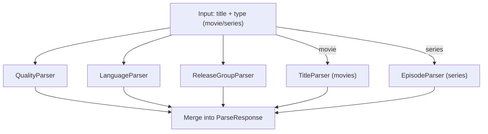
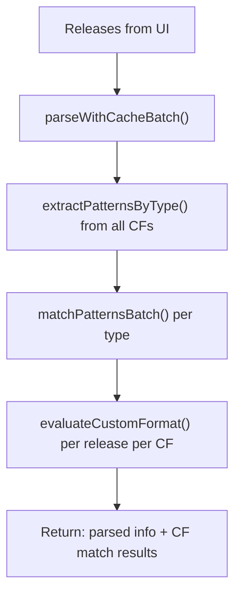

# Parser Service

**Source:** `src/services/parser/` (C# microservice),
`src/lib/server/utils/arr/parser/` (TypeScript client)

The parser is an optional C# microservice that extracts structured metadata from
release titles: resolution, source, languages, release group, episode info, and
more. It exists as a separate process because Radarr and Sonarr use .NET regex
internally, and matching against the same engine ensures custom format conditions
evaluate identically to how the Arr apps themselves would evaluate them.

When the parser is offline, features that depend on it degrade gracefully:
testing pages show warnings, evaluation endpoints skip CF matching, and regex
validation falls back to permissive behavior.

## Table of Contents

- [Service](#service)
  - [Endpoints](#endpoints)
  - [Parsers](#parsers)
  - [Parse Pipeline](#parse-pipeline)
- [Client](#client)
  - [Operations](#operations)
  - [Caching](#caching)
  - [Health Checks](#health-checks)
- [Integration](#integration)
  - [Custom Format Testing](#custom-format-testing)
  - [Entity Testing](#entity-testing)
  - [Regex Validation](#regex-validation)
- [Offline Behavior](#offline-behavior)
- [Configuration](#configuration)

## Service

The microservice is a .NET 8 minimal API (`Parser.csproj`). It is stateless
and designed to be called from Profilarr's backend for each release title that
needs parsing or pattern matching.

### Endpoints

| Method | Path              | Input                     | Output                                     |
| ------ | ----------------- | ------------------------- | ------------------------------------------ |
| POST   | `/parse`          | `{ title, type }`         | Full `ParseResponse` (all fields)          |
| POST   | `/match`          | `{ text, patterns[] }`    | `{ results: { pattern: bool } }`           |
| POST   | `/match/batch`    | `{ texts[], patterns[] }` | `{ results: { text: { pattern: bool } } }` |
| POST   | `/validate/regex` | `{ pattern }`             | `{ valid: bool, error?: string }`          |
| GET    | `/health`         | --                        | `{ status: "healthy", version }`           |

The `/match/batch` endpoint pre-compiles all patterns once with
`RegexOptions.Compiled`, then evaluates them against each text using
`Parallel.ForEach` for throughput. All regex evaluation uses a 100ms timeout
to prevent ReDoS.

### Parsers

Five independent parsers run on every `/parse` call. They do not depend on each
other's output -- each extracts a different facet from the raw title string.

| Parser                 | Extracts                                                                                                          |
| ---------------------- | ----------------------------------------------------------------------------------------------------------------- |
| **QualityParser**      | Source (Bluray, WebDL, HDTV, etc.), resolution, modifier (Remux, Screener, etc.), revision (version, repack flag) |
| **TitleParser**        | Movie title(s), year, edition, IMDB/TMDB IDs, hardcoded subs, release hash                                        |
| **EpisodeParser**      | Series title, season/episode numbers, air dates, release type (single, multi, season pack)                        |
| **LanguageParser**     | Up to 59 languages via word matches, ISO codes, regex patterns, and dubbed markers                                |
| **ReleaseGroupParser** | Scene-style (`-GROUP`) and anime-style (`[SubGroup]`) release group names                                         |

Each parser uses pre-compiled regexes tried in priority order. First match wins
(except ReleaseGroupParser which takes the last match). If a parser throws, it
returns null and the endpoint uses defaults (empty lists, zeros, nulls).

**QualityParser** handles edge cases like anime patterns (`bd720`, `bd1080`),
MPEG2 detection for RawHD, and Remux fallback logic (Remux without explicit
source assumes Bluray).

**TitleParser** tries 8+ regex patterns sequentially for movies, handling anime
with subgroups, German/French tracker formats, special editions, and
PassThePopcorn-style releases. It validates against obfuscated titles (MD5
hashes, suspicious patterns) and normalizes by removing file extensions and
torrent site suffixes.

**EpisodeParser** handles 30+ regex patterns covering standard (`S01E05`),
multi-episode (`S01E05-06`), absolute numbering (anime `#123`), daily shows
(`YYYY-MM-DD` with ambiguous date handling), mini-series (`Part 01`), and season
packs (`Season 1-2`).

**LanguageParser** detects languages through four methods in order: full word
matches, case-sensitive codes (with anti-false-positive safety for codes like
`ES`), regex patterns for abbreviations and dubbed markers, and special logic
for German DL/ML (dual/multi language) tags.

### Parse Pipeline



The merged `ParseResponse` includes: title, type, source, resolution, modifier,
revision, languages, release group, and either movie-specific fields (titles,
year, edition, IDs) or series-specific fields (series title, season, episodes,
air date, release type).

## Client

**Source:** `src/lib/server/utils/arr/parser/client.ts`

The TypeScript client is a singleton that extends `BaseHttpClient` with
connection pooling, 30-second timeout, and 2 retries with 500ms delay. It wraps
every parser endpoint and adds persistent caching for parse and match results.

### Operations

| Function                | Cached | Batch | Use case                          |
| ----------------------- | ------ | ----- | --------------------------------- |
| `parse()`               | no     | no    | Direct parse, CF testing page     |
| `parseWithCache()`      | yes    | no    | Single cached parse               |
| `parseWithCacheBatch()` | yes    | yes   | Entity testing (many releases)    |
| `matchPatterns()`       | no     | no    | CF testing (one text, N patterns) |
| `matchPatternsBatch()`  | yes    | yes   | Entity testing (many texts)       |
| `validateRegex()`       | no     | no    | Regex editor validation           |
| `isParserHealthy()`     | memory | no    | Layout-level health check         |
| `getParserVersion()`    | memory | no    | Cache invalidation key            |

Batch operations separate cached from uncached items, fetch only the uncached
ones in parallel via `Promise.all()`, store new results, and return the combined
map.

### Caching

Two database tables provide persistent caching across server restarts:

| Table                  | Key                       | Invalidation                  |
| ---------------------- | ------------------------- | ----------------------------- |
| `parsed_release_cache` | `{title}:{type}`          | Parser version mismatch       |
| `pattern_match_cache`  | `{title}` + patterns hash | Pattern set changes (SHA-256) |

When the parser version changes (detected via `getParserVersion()`), all
entries from the old version are purged. Pattern match entries are keyed by a
SHA-256 hash of the sorted pattern list, so any change to the pattern set
invalidates all affected cache rows.

Two in-memory caches avoid repeated network calls:

| Cache   | TTL              | Purpose                             |
| ------- | ---------------- | ----------------------------------- |
| Health  | 30 seconds       | Prevent blocking on every page load |
| Version | Session lifetime | Single fetch per app start          |

### Health Checks

`isParserHealthy()` uses a direct `fetch()` call with a 3-second timeout
(shorter than the client's default 30s) to avoid stalling page loads. The result
is cached in memory for 30 seconds. The global layout (`+layout.server.ts`)
calls this on every load and passes `parserAvailable` to the frontend.

## Integration

### Custom Format Testing

**Route:** `src/routes/custom-formats/[databaseId]/[id]/testing/+page.server.ts`

When a user views a custom format's test cases, the page server:

1. Checks parser health (early exit if unavailable).
2. For each test case: calls `parse()` to get the full parsed result.
3. Calls `matchPatterns()` to evaluate the format's pattern-based conditions
   against the parsed title, edition, and release group.
4. Runs `evaluateCustomFormat()` with the parsed data and match maps.
5. Returns per-condition results and an overall match boolean.

This path uses single (non-batch) calls because it evaluates one CF at a time
with a small number of test cases.

### Entity Testing

**Route:** `src/routes/api/v1/entity-testing/evaluate/+server.ts`

Entity testing evaluates quality profile scoring against many releases across
all custom formats. The evaluation flow uses batch operations for performance:



The evaluator (`customFormats/evaluator.ts`) groups patterns by condition type
(title, edition, release group) before batch matching, ensuring each unique
text is only matched once against each pattern set.

### Regex Validation

**Routes:** regex editor page, regex creation page

`validateRegex()` sends the pattern to the C# service for compilation against
the .NET regex engine. This catches patterns that are valid in JavaScript but
invalid in .NET (or vice versa). Returns `{ valid, error? }` or null if the
parser is offline (the save is not blocked).

## Offline Behavior

| Feature            | Behavior when parser is offline               |
| ------------------ | --------------------------------------------- |
| CF testing page    | Returns unknown results, shows parser warning |
| Entity testing API | Returns parsed info only, skips CF evaluation |
| Regex validation   | Returns null, does not block saves            |
| Health check       | Returns false, UI shows warning banner        |
| Parse/match calls  | Return null, callers handle gracefully        |

## Configuration

The service reads `appsettings.json` for logging and version settings:

```json
{
	"ParserLogging": {
		"Enabled": true,
		"ConsoleLogging": true,
		"FileLogging": false,
		"MinLevel": "INFO"
	},
	"Parser": { "Version": "1.0.0" }
}
```

Environment variable overrides: `PARSER_LOG_ENABLED`, `PARSER_LOG_FILE`,
`PARSER_LOG_CONSOLE`, `PARSER_LOG_LEVEL`, `PARSER_LOGS_DIR` (default
`/tmp/parser-logs`). The service detects Docker containers (via `/.dockerenv`
or `/proc/1/cgroup`) and logs container-specific environment variables at
startup (PUID, PGID, UMASK, TZ).

Console output uses colored ANSI formatting. File output uses JSON-lines with
daily rotation, matching the main Profilarr [logger](./logger.md) conventions.
