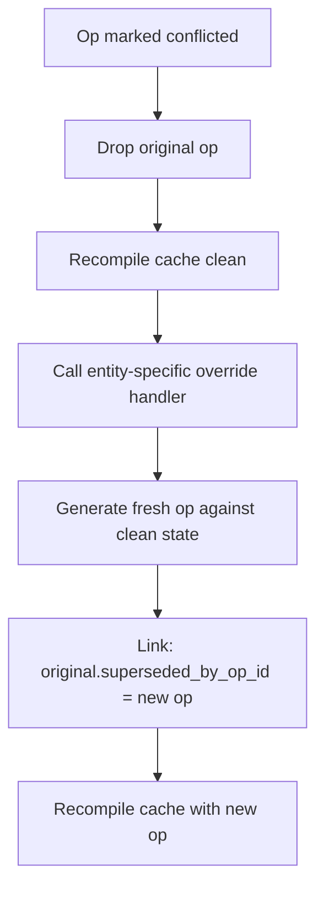
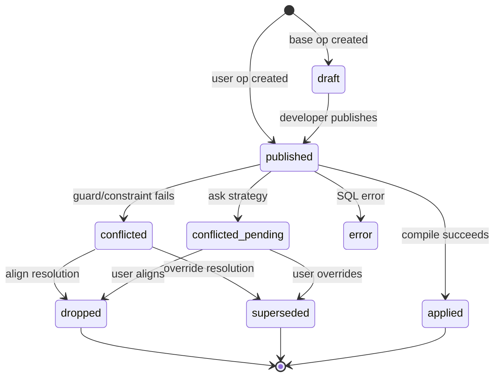

# PCD System

**Source:** `src/lib/server/pcd/` (core, ops, database, entities, conflicts)
**Shared types:** `src/lib/shared/pcd/types.ts`
**Schema repo:** [Dictionarry-Hub/schema](https://github.com/Dictionarry-Hub/schema)

## Table of Contents

- [What is a PCD](#what-is-a-pcd)
- [Schema](#schema)
  - [Entity Relationships](#entity-relationships)
- [Layers and Compilation](#layers-and-compilation)
- [Writer](#writer)
  - [Kysely to SQL](#kysely-to-sql)
  - [Validation](#validation)
  - [Metadata and Desired State](#metadata-and-desired-state)
  - [Cancel-Out](#cancel-out)
  - [Base vs User](#base-vs-user)
- [Value Guards](#value-guards)
  - [Op Splitting](#op-splitting)
- [Conflicts](#conflicts)
  - [What Causes Conflicts](#what-causes-conflicts)
  - [Conflict Strategies](#conflict-strategies)
  - [Auto-Align Rules](#auto-align-rules)
  - [Override Flow](#override-flow)
  - [Full-List Conflicts](#full-list-conflicts)
- [Op Lifecycle](#op-lifecycle)
- [Type Generation](#type-generation)
- [Open Work](#open-work)

## What is a PCD

A **Profilarr Compliant Database** is a Git-hosted configuration dataset for
Arr apps, expressed as append-only SQL operations. It solves the problem of
managing Arr configuration at scale: quality profiles with dozens of custom
format scores, custom formats with shared regex patterns and test cases,
naming presets, delay profiles -- all interconnected, all tedious to
maintain by hand across multiple instances.

A PCD developer curates this dataset: writing regex patterns, building
custom formats from those patterns, scoring them in quality profiles, adding
test cases. End users link a PCD and sync it into their Arr instances while
keeping local tweaks (their own score overrides, disabled formats, extra
profiles) that survive upstream updates.

The system is **database-first**. Every configuration change is stored as an
append-only operation in SQLite (`pcd_ops` table). On every compile, all
ops are replayed in layer order into an in-memory SQLite cache. The cache
is the source of truth for reads, validation, and sync payloads. Repo files
are imported into the database when a PCD is linked, and exported back when
a developer publishes a release.

Each PCD repo includes a `pcd.json` manifest:

```json
{
	"name": "db",
	"version": "2.1.35",
	"description": "Seraphys' OCD Playground",
	"arr_types": ["radarr", "sonarr", "whisparr"],
	"dependencies": { "schema": "^1.1.0" }
}
```

## Schema

The PCD schema is defined by a separate **schema PCD**
([Dictionarry-Hub/schema](https://github.com/Dictionarry-Hub/schema)). It
contains only DDL and seed data -- no configuration content. The schema is
applied as the first layer during compile, before any base ops.

For how to safely evolve the schema, see
[schema-bump.md](./schema-bump.md).

### Entity Relationships

The schema defines ~35 tables organized into entity groups. All
cross-entity foreign keys reference by **name** (not auto-increment ID),
with `ON DELETE CASCADE` so deleting a parent removes all dependents.

```mermaid
erDiagram
    tags ||--o{ regular_expression_tags : ""
    tags ||--o{ custom_format_tags : ""
    tags ||--o{ quality_profile_tags : ""

    regular_expressions ||--o{ regular_expression_tags : ""
    regular_expressions ||--o{ condition_patterns : ""

    custom_formats ||--o{ custom_format_tags : ""
    custom_formats ||--o{ custom_format_conditions : ""
    custom_formats ||--o{ custom_format_tests : ""
    custom_formats ||--o{ quality_profile_custom_formats : ""

    custom_format_conditions ||--|| condition_patterns : "one type table"
    custom_format_conditions ||--|| condition_languages : ""
    custom_format_conditions ||--|| condition_sources : ""
    custom_format_conditions ||--|| condition_resolutions : ""
    custom_format_conditions ||--|| condition_quality_modifiers : ""
    custom_format_conditions ||--|| condition_indexer_flags : ""
    custom_format_conditions ||--|| condition_sizes : ""
    custom_format_conditions ||--|| condition_release_types : ""
    custom_format_conditions ||--|| condition_years : ""

    quality_profiles ||--o{ quality_profile_tags : ""
    quality_profiles ||--o{ quality_profile_languages : ""
    quality_profiles ||--o{ quality_profile_qualities : ""
    quality_profiles ||--o{ quality_profile_custom_formats : ""
    quality_profiles ||--o{ quality_groups : ""

    quality_groups ||--o{ quality_group_members : ""
    qualities ||--o{ quality_group_members : ""
    qualities ||--o{ quality_profile_qualities : ""
    languages ||--o{ quality_profile_languages : ""
    languages ||--o{ condition_languages : ""
```



**Entity groups:**

| Group               | Key tables                                                        |
| ------------------- | ----------------------------------------------------------------- |
| Core                | tags, languages, qualities, quality_api_mappings                  |
| Custom formats      | custom_formats, custom_format_conditions, 9 condition type tables |
| Quality profiles    | quality_profiles, quality_groups, quality_group_members, scoring  |
| Regular expressions | regular_expressions, regular_expression_tags                      |
| Delay profiles      | delay_profiles                                                    |
| Media management    | radarr/sonarr_naming, \_media_settings, \_quality_definitions     |
| Testing             | custom_format_tests, test_entities, test_releases                 |

**Condition polymorphism:** each custom format condition has a `type` field
and stores its type-specific data in exactly one of nine tables
(condition_patterns, condition_languages, condition_sources, etc.), joined
by `(custom_format_name, condition_name)`.

**Quality profile hierarchy:** a profile contains an ordered list of
qualities and/or quality groups, custom format scores (per arr_type),
language selections, and tags. Groups are profile-specific -- profiles
don't share groups.

## Layers and Compilation

Every compile replays ops in four layers:

```
1. Schema    (files from deps/schema/ops/)    DDL + seed data
2. Base      (pcd_ops, origin='base')         Published, then drafts
3. Tweaks    (files from tweaks/)             Optional repo-local SQL
4. User      (pcd_ops, origin='user')         Local overrides
```

`loadAllOperations()` in `ops/loadOps.ts` assembles the full op list. File
ops are read from disk; database ops are loaded from `pcd_ops` ordered by
`sequence` (falling back to `id`). Base drafts use a high sequence offset
(`DRAFT_SEQUENCE_BASE = 3,000,000,000`) to ensure they run after all
published base ops.

The cache (`database/cache.ts`) is an in-memory SQLite database. The build
process:

1. Create in-memory DB, enable foreign keys, initialize Kysely.
2. Register helper functions -- `qp()`, `cf()`, `dp()`, `tag()` -- that
   resolve entity names to auto-increment IDs at execution time.
3. Execute each op via `db.exec(sql)`, tracking `db.totalChanges` before
   and after to get the rowcount.
4. For user ops: record the result in `pcd_op_history` (applied, conflicted,
   dropped, or error) and run conflict detection (see [Conflicts](#conflicts)).
5. Return stats: ops per layer, build timing, and a `needsRebuild` flag
   (set when an op is force-dropped, requiring a clean rebuild).

The cache powers all reads, validation, and sync payloads. It's held in a
global registry (`database/registry.ts`) keyed by database instance ID and
rebuilt after every write.

## Writer

The writer (`ops/writer.ts`) is the single entry point for persisting new
ops. Every entity mutation -- create, update, delete -- flows through
`writeOperation()`.

### Kysely to SQL

Entity code builds type-safe queries using Kysely against the cache's
`kb` instance, then calls `.compile()` to get a `CompiledQuery` (SQL
string with `?` placeholders + parameter array). `compiledQueryToSql()`
in `utils/sql.ts` substitutes the parameters into the SQL to produce a
fully executable string. Multiple statements are joined with `;\n\n`.

```ts
const query = db.insertInto('custom_formats').values({ name: 'HDR10+', description: '' }).compile();
// compiledQueryToSql(query) -> "INSERT INTO custom_formats ..."
```

### Validation

Before writing, the writer validates the SQL against the current cache
using a SAVEPOINT (dry-run transaction). The statements are executed
inside the savepoint, then rolled back. If any constraint fails (foreign
key, unique, NOT NULL, CHECK), the write is rejected with a detailed
error before anything is persisted.

### Metadata and Desired State

Each op stores two JSON blobs alongside its SQL:

**Metadata** describes what the op does:

| Field           | Purpose                                            |
| --------------- | -------------------------------------------------- |
| `operation`     | create, update, or delete                          |
| `entity`        | Entity type (custom_format, quality_profile, etc.) |
| `name`          | Entity name                                        |
| `previousName`  | Original name if renamed                           |
| `stableKey`     | `{ key, value }` to locate the entity              |
| `groupId`       | UUID grouping ops created as part of one action    |
| `changedFields` | List of modified field names                       |
| `dependsOn`     | Entities this op depends on                        |
| `generated`     | True if auto-generated as a dependency cascade     |

**Desired state** captures the intended outcome as `from`/`to` pairs:

```json
{
	"description": { "from": "old text", "to": "new text" },
	"tags": ["hdr", "quality"]
}
```

This is used by the conflict system to determine whether the user's goal
was already achieved (auto-align) or to regenerate the op against a clean
cache state (override).

A SHA-256 **content hash** of `sql + metadata` is stored for
deduplication.

### Cancel-Out

When a user deletes an entity they just created (same layer, no dependent
ops referencing it), the writer marks the original create op as `dropped`
instead of writing a new delete op. This avoids accumulating redundant
create-then-delete pairs.

### Base vs User

| Aspect         | Base layer             | User layer            |
| -------------- | ---------------------- | --------------------- |
| Origin         | `'base'`               | `'user'`              |
| Initial state  | `'draft'`              | `'published'`         |
| Auth           | Requires PAT           | Session auth          |
| Conflict track | Not tracked in history | Tracked with strategy |
| Execution      | Before tweaks          | After tweaks (last)   |

## Value Guards

UPDATE and DELETE ops include **value guards** -- WHERE clauses that check
the old value of each field being changed. If the upstream PCD has modified
a field since the user op was created, the guard doesn't match, the
statement affects zero rows, and the op is flagged as conflicted.

```sql
UPDATE custom_formats
SET description = 'user override'
WHERE name = 'HDR10+'
  AND description = 'original text'   -- value guard
```

If `description` was changed upstream to something else, this UPDATE
matches zero rows. The cache build detects `rowcount === 0` and marks
the op as conflicted.

### Op Splitting

To maximize the chance that non-conflicting changes survive, multi-field
updates are split into **separate ops per field**. If a user changes both
the description and the tags of a custom format, those become two
independent ops. If upstream changes the description but not the tags, only
the description op conflicts -- the tag op still applies cleanly.

Op splitting is implemented for custom format general/conditions, quality
profile general/qualities/scoring, and regular expressions. Delay profiles
and media management use base-origin locking instead (entities from base
are not editable at the user layer). See
[#421](https://github.com/Dictionarry-Hub/profilarr/issues/421) for
remaining work.

## Conflicts

Conflicts are the core complexity of the PCD system. They occur when a user
op can't apply cleanly against the current compiled state -- typically
because the upstream PCD changed something the user also modified.

### What Causes Conflicts

| Cause             | Detection                                      | Reason code      |
| ----------------- | ---------------------------------------------- | ---------------- |
| Guard mismatch    | `rowcount === 0` after executing UPDATE/DELETE | `guard_mismatch` |
| Duplicate key     | UNIQUE constraint error on INSERT              | `duplicate_key`  |
| Missing target    | Foreign key constraint error                   | `missing_target` |
| Partial execution | Full-list check: desired state != actual state | `guard_mismatch` |

### Conflict Strategies

Each database instance has a `conflict_strategy` setting:

**align** -- upstream always wins. Any conflicted user op is automatically
dropped. The user's change is discarded in favor of the upstream state.
Best for fully upstream-driven configs where local tweaks are minimal.

**override** (default) -- user always wins. Conflicted ops are
automatically regenerated: the original is dropped, the cache is rebuilt
clean, and an entity-specific handler creates a fresh op that achieves the
same goal against the current state. The old op is linked to the new one
via `superseded_by_op_id` for audit. Up to 10 rounds of override are
attempted (cascading conflicts can produce new conflicts). Best for
user-first configs.

**ask** -- manual review. Conflicted ops are marked `conflicted_pending`
and surfaced in the UI. The user chooses per-op: align (drop it) or
override (regenerate it). Best for high-stakes configs where changes should
be reviewed.

### Auto-Align Rules

Even in override/ask mode, some conflicts can be safely auto-aligned
because the user's goal was already achieved or the target no longer
exists. Rules in `conflicts/autoAlign/rules/`:

| Rule                             | When it fires                                 | Rationale                |
| -------------------------------- | --------------------------------------------- | ------------------------ |
| `defaultFieldGuardRule`          | Desired "to" value already matches DB state   | Goal already achieved    |
| `missingTargetDeleteRule`        | Entity being deleted no longer exists         | Goal already achieved    |
| `qualityProfileQualitiesRowRule` | Row being updated no longer exists in profile | Row was removed upstream |
| `qualityProfileScoringRowRule`   | Scoring row no longer exists in profile       | Row was removed upstream |

### Override Flow

When override triggers (automatically or via user choice in ask mode):



Entity-specific handlers live in `pcd/entities/*/override/`. Each entity
type knows how to reconstruct its ops from the `desired_state` payload.
For example, `cfOverrideUpdate()` reads the desired description, tags,
and conditions from the original op's desired state and writes new ops
that achieve the same result against the current cache.

### Full-List Conflicts

Some ops update ordered lists (quality profile qualities, scoring). These
emit multiple SQL statements in a single op. If some statements succeed
but others fail their guards, the aggregate rowcount is > 0, hiding the
partial failure.

`checkFullListConflict()` catches this by comparing the desired
`ordered_items.to` state against the actual DB state after execution. If
they don't match, the op is marked as conflicted even though some rows
were applied. The cache is rebuilt to undo the partial application.

## Op Lifecycle



The `pcd_op_history` table records one row per op per compile, tracking
status, rowcount, conflict reason, and error details. This powers the
conflict UI and provides an audit trail.

## Type Generation

**Source:** `scripts/generate-pcd-types.ts`
**Output:** `src/lib/shared/pcd/types.ts`

The PCD schema is the source of truth for TypeScript types. Rather than
maintaining types by hand, a generator script introspects the schema SQL
and produces typed interfaces for Kysely queries and query results.

**How it works:**

1. Fetch the schema SQL from GitHub (`Dictionarry-Hub/schema` repo, branch
   = version) or load a local file via `--local=`.
2. Execute the SQL in an in-memory SQLite database.
3. Introspect every table using `PRAGMA table_info` and `PRAGMA foreign_key_list`.
4. Parse `CHECK (column IN (...))` constraints from the `CREATE TABLE` SQL
   to extract union types automatically.
5. Generate two interface sets per table: a Kysely table interface (with
   `Generated<T>` for auto-increment and defaulted columns) and a row type
   (plain types for query results).
6. Write the output to `src/lib/shared/pcd/types.ts`.

**Semantic type resolution** follows a priority chain:

1. **Manual overrides** (`COLUMN_TYPE_OVERRIDES`) for columns that store
   integers in SQLite but need string unions in TypeScript. Currently used
   for Sonarr's `colon_replacement_format` and `multi_episode_style` enums.
   Runtime conversion functions live in `src/lib/shared/pcd/conversions.ts`.
2. **CHECK constraints** parsed from the DDL. Any `CHECK (col IN ('a', 'b'))`
   becomes `'a' | 'b'`.
3. **Boolean pattern matching** on column names: prefixes like `is_`, `has_`,
   `enable_`, suffixes like `_allowed`, `_enabled`, and exact matches like
   `negate` and `required` produce `boolean` instead of `number`.
4. **SQLite type mapping** as the fallback (INTEGER -> number, TEXT -> string).

Run via `deno task generate:pcd-types` (default version) or
`deno task generate:pcd-types --version=1.1.0` for a specific schema version.

## Open Work

- [**#421**](https://github.com/Dictionarry-Hub/profilarr/issues/421):
  Op splitting is done for CF and QP entities but not yet for regular
  expressions. Delay profiles and media management will use base-origin
  locking instead of per-field splits.

- [**#367**](https://github.com/Dictionarry-Hub/profilarr/issues/367):
  Stable entity IDs. Currently, entities are identified by name, and
  renames cascade across all foreign key references. This makes revert
  fragile. The plan is to assign stable, immutable IDs at op creation
  time and switch cross-table references from name-based to ID-based FKs.
  This unblocks user op history and safe revert.

- [**#422**](https://github.com/Dictionarry-Hub/profilarr/issues/422):
  The PCD conflict test suite (86 Playwright specs) needs to migrate to
  integration tests for speed and CI reliability.
