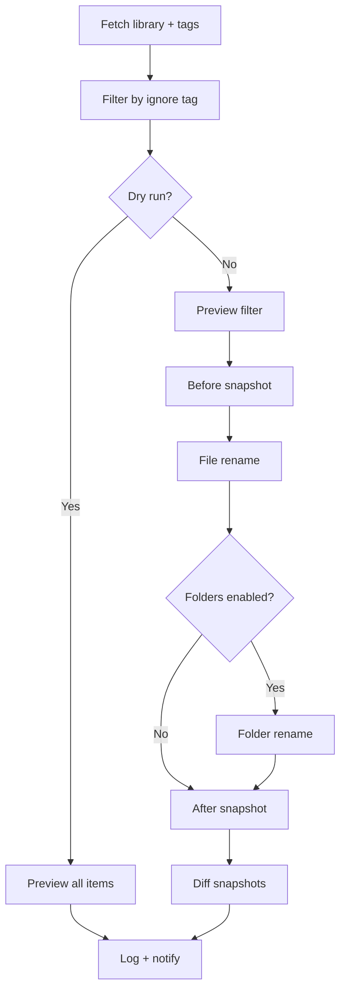

# Rename

**Source:** `src/lib/server/rename/` (processor.ts, core.ts, types.ts, logger.ts)

## Table of Contents

- [Pipeline](#pipeline)
  - [Adapter Pattern](#adapter-pattern)
  - [Ignore Tag](#ignore-tag)
  - [Dry Run vs Live](#dry-run-vs-live)
  - [Status](#status)
- [Configuration](#configuration)
- [Logging](#logging)
- [Notifications](#notifications)
- [Restart Safety](#restart-safety)

The rename system is a scheduled job that scans Arr libraries and issues rename
commands when files or folders don't match the current naming configuration.
Common reasons a rename is needed: TBA episodes that now have real titles,
custom format updates that change preferred naming tokens, or a naming config
change applied after media was already imported.

Each Arr instance has its own rename config with independent scheduling, tag
filtering, and notification preferences. Runs can also be triggered manually
from the UI with an optional dry-run toggle.

## Pipeline

Processing starts in `processRenameConfig()` and follows a fixed sequence:

### Adapter pattern

Radarr and Sonarr have different APIs for fetching libraries, triggering
renames, and reading file metadata. The processor wraps each client in an
adapter (`createRadarrAdapter` / `createSonarrAdapter`) that exposes a unified
`RenameAdapter` interface: `getLibraryItems`, `getTags`, `getRenamePreview`,
`renameFiles`, `renameFolders`, `waitForCommand`, `getSnapshot`. All
downstream code works against this interface.

### Ignore tag

If `settings.ignoreTag` is set, items tagged with that label are filtered out
before any rename work begins. The run is skipped entirely if no items remain
after filtering.

### Dry run vs live

**Dry run** calls the Arr preview endpoint for every item and records what
_would_ change without issuing any rename commands. Useful for auditing before
enabling live runs.

**Live** follows a longer path:

1. **Preview filter** -- calls the preview endpoint (concurrency 10) to find
   items that actually need file renames. Items with empty previews are dropped.
2. **Before snapshot** -- captures each entity's folder path and file relative
   paths so the processor can diff after renaming.
3. **File rename** -- batches item IDs and calls the Arr rename endpoint.
   Radarr batches at 50, Sonarr at 10 (smaller to avoid DB lock pressure).
   Each batch triggers a command that the processor waits on.
4. **Folder rename** (if `renameFolders` is enabled) -- groups items by root
   folder and calls the Arr editor endpoint per group. Folder renames spawn a
   background "Bulk Move" command; `waitForSpawnedCommand` polls `getCommands`
   every second for up to 30 seconds to find and await it.
5. **After snapshot** -- captures the same entities again.
6. **Diff** -- `diffSnapshots()` compares before/after by entity ID. Folder
   path changes and file relative path changes (matched by file ID) are
   recorded as the source of truth for what actually changed, overriding
   preview counts.

### Status

| Status    | Meaning                                        |
| --------- | ---------------------------------------------- |
| `success` | At least one rename completed, no errors       |
| `partial` | Some renames completed, but errors occurred    |
| `failed`  | Errors occurred and nothing was renamed        |
| `skipped` | No items needed renaming (or filtered to zero) |

## Configuration

Settings are stored per instance in `arr_rename_settings` (one row per Arr
instance):

| Column                  | Type    | Default     | Purpose                           |
| ----------------------- | ------- | ----------- | --------------------------------- |
| `enabled`               | boolean | false       | Enable scheduled runs             |
| `cron`                  | text    | `0 0 * * *` | Cron schedule (10-minute minimum) |
| `rename_folders`        | boolean | false       | Also rename folder names          |
| `ignore_tag`            | text    | null        | Skip items with this Arr tag      |
| `summary_notifications` | boolean | true        | Compact vs detailed notifications |

The job system manages scheduling via `nextRunAt` / `lastRunAt`. After each
run, the handler calculates the next cron occurrence and updates `nextRunAt`.
See [jobs.md](./jobs.md) for the dispatch and scheduling details.

## Logging

Every run produces a `RenameJobLog` that captures the full funnel:

- **Config snapshot** -- dryRun, renameFolders, ignoreTag, manual flag
- **Library stats** -- total items fetched, fetch duration in ms
- **Filtering** -- items remaining after ignore tag, items skipped
- **Results** -- files needing rename (from preview), files actually renamed
  (from diff), folders renamed, commands triggered/completed/failed, errors
- **Renamed items** -- per-item array with title, folder before/after, file
  paths before/after, and poster URL

Three logging functions in `logger.ts`:

- `logRenameRun(log)` -- persists the full log to the `rename_runs` table and
  writes an INFO-level summary to the [logger](./logger.md) with source
  `RenameJob`.
- `logRenameSkipped(instanceId, name, reason)` -- DEBUG-level, no database
  persistence.
- `logRenameError(instanceId, name, error)` -- ERROR-level, no database
  persistence.

## Notifications

Rename runs emit one of four notification types via the
[notification system](./notifications.md):

| Type             | Severity | When                        |
| ---------------- | -------- | --------------------------- |
| `rename.success` | success  | Files renamed, no errors    |
| `rename.partial` | warning  | Some renames, some errors   |
| `rename.failed`  | error    | No renames, errors occurred |
| `rename.skipped` | success  | Nothing needed renaming     |

Notifications are not sent for dry runs.

The `summaryNotifications` setting controls detail level. **Summary mode**
includes one sample rename and a count of the rest. **Rich mode** includes
every renamed item with poster images and before/after paths. For Sonarr, rich
mode groups files by season (parsed from `S##E##` patterns in filenames).

## Restart Safety

If Profilarr crashes mid-rename, the job queue recovers the job to `queued`
status and re-runs it from scratch. This is safe because:

- The preview filter skips files that are already correctly named.
- The folder editor endpoint is idempotent.
- Snapshots are taken fresh, so the diff only captures actual changes.
