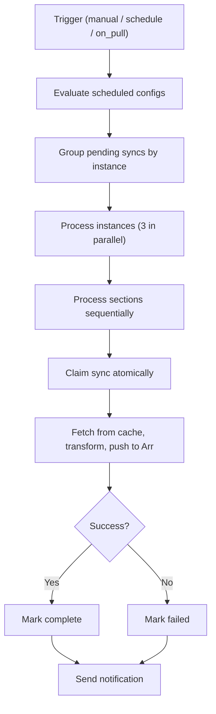
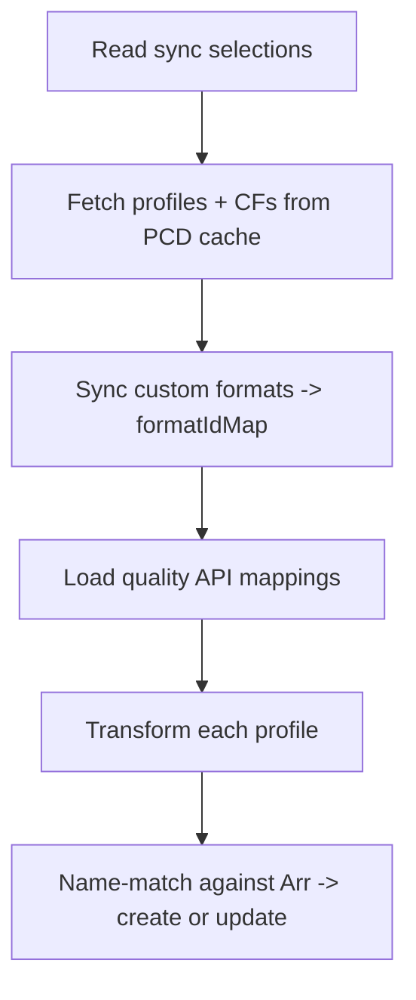

# Sync

**Source:** `src/lib/server/sync/` (processor, base, registry, mappings,
customFormats/, qualityProfiles/, delayProfiles/, mediaManagement/)

The sync system pushes compiled PCD configuration from the in-memory cache into
live Arr instances via their HTTP APIs. It reads entity state from the PCD cache
(see [pcd.md](./pcd.md)), transforms it into Arr API payloads, and creates or
updates resources by name. There is no diff tracking or rollback. Operations are
idempotent on retry because name-based matching converts would-be creates into
updates for items that already exist.

## Table of Contents

- [Pipeline](#pipeline)
  - [Triggers](#triggers)
  - [Processor Flow](#processor-flow)
  - [Status](#status)
- [Section Registry](#section-registry)
- [Transformation](#transformation)
  - [Custom Formats](#custom-formats)
  - [Quality Profiles](#quality-profiles)
  - [Delay Profiles](#delay-profiles)
  - [Media Management](#media-management)
- [Entity Sync](#entity-sync)
- [Cleanup](#cleanup)
  - [Config Cleanup](#config-cleanup)
  - [Entity Cleanup](#entity-cleanup)
- [Impact Analysis](#impact-analysis)
- [Error Handling and Recovery](#error-handling-and-recovery)
- [Logging and Notifications](#logging-and-notifications)

## Pipeline

### Triggers

| Trigger    | Source                           | Entry point                   |
| ---------- | -------------------------------- | ----------------------------- |
| `manual`   | POST /api/v1/databases/{id}/sync | `syncInstance()` in processor |
| `schedule` | Cron expression per section      | `evaluateScheduledSyncs()`    |
| `on_pull`  | PCD git pull completes           | `triggerSyncs()`              |

Manual syncs process all configured sections regardless of the `should_sync`
flag. Schedule and on_pull mark individual sections as pending and enqueue
section-specific jobs. See [jobs.md](./jobs.md) for dispatch mechanics.

### Processor Flow

`CONCURRENCY_LIMIT = 3` caps parallel instance processing via
`processBatches()`. Sections run sequentially within an instance because quality
profiles depend on custom formats being synced first (profiles reference CF IDs
for scoring). `claimSync()` atomically transitions `sync_status` from `pending`
to `in_progress`, preventing double-processing if a job fires while the
previous run is still active.

### Status

| Status    | Meaning                               |
| --------- | ------------------------------------- |
| `success` | All sections completed without errors |
| `partial` | Some sections succeeded, some failed  |
| `failed`  | All sections failed                   |

## Section Registry

The registry (`registry.ts`) decouples the processor from section-specific
logic. Each section type implements a `SectionHandler` interface:

| Method                    | Purpose                                   |
| ------------------------- | ----------------------------------------- |
| `claimSync()`             | Atomic pending-to-in_progress transition  |
| `completeSync()`          | Mark section as synced, update timestamp  |
| `failSync()`              | Record error message                      |
| `setStatusPending()`      | Mark for next sync cycle                  |
| `getPendingInstanceIds()` | Query instances needing sync              |
| `getScheduledConfigs()`   | Return cron + nextRunAt for scheduling    |
| `createSyncer()`          | Factory for section-specific BaseSyncer   |
| `hasConfig()`             | Whether the instance has anything to sync |

Three handlers register themselves on import via `registerSection()`:

| Section           | Config scope                                                            |
| ----------------- | ----------------------------------------------------------------------- |
| `qualityProfiles` | Multi-profile selection from one database                               |
| `delayProfiles`   | Single profile selection (or none)                                      |
| `mediaManagement` | Three independent configs (naming, media settings, quality definitions) |

## Transformation

The transformation layer converts PCD cache entities into Arr API payloads.
Each section has its own transformer. The system fetches the current Arr state,
matches by name, and creates or updates as needed.

### Custom Formats

**Source:** `customFormats/transformer.ts`

The CF transformer maps PCD conditions to Arr "specifications." Each condition
type maps to an Arr implementation class:

| PCD type           | Arr implementation             | Arr-type filter |
| ------------------ | ------------------------------ | --------------- |
| `release_title`    | `ReleaseTitleSpecification`    | all             |
| `release_group`    | `ReleaseGroupSpecification`    | all             |
| `edition`          | `EditionSpecification`         | all             |
| `source`           | `SourceSpecification`          | all             |
| `resolution`       | `ResolutionSpecification`      | all             |
| `indexer_flag`     | `IndexerFlagSpecification`     | all             |
| `quality_modifier` | `QualityModifierSpecification` | Radarr only     |
| `release_type`     | `ReleaseTypeSpecification`     | Sonarr only     |
| `size`             | `SizeSpecification`            | all             |
| `language`         | `LanguageSpecification`        | all             |
| `year`             | `YearSpecification`            | all             |

Key behaviors:

- Conditions whose `arrType` targets a different app are filtered out (e.g.
  `quality_modifier` conditions are dropped for Sonarr).
- Pattern-based conditions (`release_title`, `release_group`, `edition`) use the
  linked regular expression's `pattern` field as the specification value.
- Enum conditions (`source`, `resolution`, `indexer_flag`, etc.) resolve PCD
  string names to Arr integer IDs via `mappings.ts`. Radarr and Sonarr use
  different integer values for the same concept.
- `syncCustomFormats()` returns a `Map<name, arrId>` covering every CF on the
  instance (not just synced ones). Quality profiles need this because the Arr API
  requires every CF to appear in profile `formatItems`.

### Quality Profiles

**Source:** `qualityProfiles/transformer.ts`

QP sync has a hard dependency on custom formats: CFs must be synced first
because profiles reference CF IDs for scoring.

Transformation details:

- **Quality items**: PCD quality names map to Arr API names via the
  `quality_api_mappings` table. `mapQualityName()` handles naming differences
  between apps (Sonarr uses `Bluray-1080p Remux`, Radarr uses `Remux-1080p`).
- **Groups**: PCD group IDs are remapped to `1000 + index` (Arr convention).
  Members are nested inside their group. All unused qualities are appended as
  disabled entries.
- **Quality ordering**: Items are reversed to match the Arr's expected order
  (highest quality first in Arr API, last in PCD).
- **Scoring**: Explicit CF scores from the profile are resolved via
  `formatIdMap`. All remaining CFs on the instance are included with score 0
  (Arr validation requires the full set).
- **Language**: Radarr profiles include a language field. Sonarr always omits it
  (Sonarr uses custom formats for language filtering).
- **Upgrade fields**: `cutoffFormatScore`, `minFormatScore`, and
  `minUpgradeFormatScore` (minimum 1) map directly.

### Delay Profiles

**Source:** `delayProfiles/syncer.ts`

Single-profile sync that always overwrites the default Arr profile (id=1). The
PCD `preferred_protocol` enum maps to Arr fields:

| PCD value        | enableUsenet | enableTorrent | preferredProtocol |
| ---------------- | ------------ | ------------- | ----------------- |
| `prefer_usenet`  | true         | true          | usenet            |
| `prefer_torrent` | true         | true          | torrent           |
| `only_usenet`    | true         | false         | usenet            |
| `only_torrent`   | false        | true          | torrent           |

Hardcoded defaults: `order = 2147483647` (max int, default profile ordering),
`tags = []` (default profile cannot have tags).

### Media Management

**Source:** `mediaManagement/syncer.ts`, `handler.ts`

Three independent configs, each following a GET-merge-PUT pattern: fetch the
full Arr config, overwrite only PCD-managed fields, PUT it back.

| Config              | PCD tables                        | Arr endpoint            |
| ------------------- | --------------------------------- | ----------------------- |
| Media Settings      | radarr/sonarr_media_settings      | /config/mediamanagement |
| Naming              | radarr/sonarr_naming              | /config/naming          |
| Quality Definitions | radarr/sonarr_quality_definitions | /qualitydefinition      |

Naming fields differ by app: Radarr has movie format and folder format. Sonarr
adds standard/daily/anime episode formats, series folder, season folder, and
multi-episode style.

Quality definitions match PCD quality names to Arr API names via the same
mapping table, then update `minSize`, `maxSize`, and `preferredSize` per tier.
PCD stores 0 for "unlimited"; the transformer converts to null.

## Entity Sync

**Source:** `entitySync.ts`

Targeted single-entity sync executed inline (no job queue). Used when the UI
saves an entity and the user wants to push immediately. Supported types:
quality profiles, custom formats, regular expressions (cascading to all CFs
using the regex), delay profiles, naming, quality definitions, and media
settings.

Entity sync uses the same transform logic as batch sync but operates on a
single entity. For quality profiles, the first-time path syncs referenced CFs;
the update path reuses existing Arr CF IDs.

## Cleanup

### Config Cleanup

**Source:** `cleanup.ts`

Scans an Arr instance for custom formats and quality profiles that exist on the
instance but are not referenced by current sync selections. The scan compares
the Arr's full list against the expected set derived from sync config.

Deletion order: CFs first, then QPs. Quality profiles assigned to media return
HTTP 500 from the Arr API and are skipped with a warning.

### Entity Cleanup

**Source:** `entityCleanup.ts`

Detects media removed from TMDB/TVDB by reading the Arr health API. Health
messages with source `RemovedMovieCheck` (Radarr) or `RemovedSeriesCheck`
(Sonarr) contain external IDs. The system extracts these IDs via regex, matches
them against the library, and offers scan/delete operations.

## Impact Analysis

**Source:** `affectedArrs.ts`

Answers "which Arr instances would be affected by editing this entity?" The
dependency graph traverses: regex -> CFs using it -> QPs referencing those CFs
-> instances syncing those QPs. Used by the UI to show affected instances before
pushing changes. Supports all entity types.

## Error Handling and Recovery

- **Per-item isolation**: Each CF or QP push is wrapped in try/catch. A single
  failed item does not abort the section.
- **No rollback**: Operations are independent. A partially synced section leaves
  the instance in a valid (if incomplete) state. Retrying picks up where it left
  off because name-based matching converts creates to updates.
- **Startup recovery**: `recoverInterruptedSyncs()` resets any `in_progress`
  syncs back to `pending` so they retry on the next cycle. Called during server
  startup from `utils.ts`.
- **Atomic claim**: `claimSync()` prevents double-processing if the sync job
  fires while a previous run is still active.

## Logging and Notifications

Logging uses tagged sources per subsystem:

| Source                      | Scope                          |
| --------------------------- | ------------------------------ |
| `SyncProcessor`             | Instance grouping, scheduling  |
| `Syncer`                    | Base syncer lifecycle          |
| `Sync:QualityProfiles`      | QP create/update results       |
| `Sync:CustomFormats`        | CF create/update results       |
| `Sync:DelayProfile`         | Delay profile sync             |
| `Sync:MediaManagement`      | Media management umbrella      |
| `Sync:Naming`               | Naming config sync             |
| `Sync:MediaSettings`        | Media settings sync            |
| `Sync:QualityDefinitions`   | Quality definitions sync       |
| `EntitySync:*`              | Per-type entity sync           |
| `Cleanup` / `EntityCleanup` | Stale config and media cleanup |
| `SyncRecovery`              | Startup recovery               |

Sync notifications use the `arrSync()` definition from the
[notification system](./notifications.md). Three severities based on section
results:

| Type               | Severity | When                                 |
| ------------------ | -------- | ------------------------------------ |
| `arr.sync.success` | success  | All sections succeeded               |
| `arr.sync.partial` | warning  | Some sections succeeded, some failed |
| `arr.sync.failed`  | error    | All sections failed                  |

Each notification includes per-section summary lines with item counts and
actions (created/updated).
