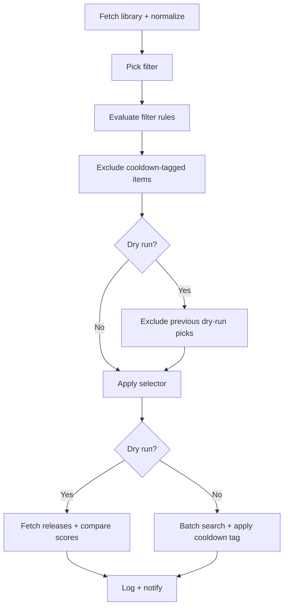

# Upgrades

**Source:** `src/lib/server/upgrades/` (processor, cooldown, normalize, logger)
**Shared:** `src/lib/shared/upgrades/` (filters, selectors)

The upgrade system is a scheduled job that proactively searches Arr for better
releases. It fills the gap that RSS alone can't cover: new quality profiles,
profile score updates, and indexer downtime all leave existing library items
with suboptimal files that RSS will never revisit. Upgrades work through the
library methodically, one filter at a time, searching for improvements and
letting Arr's own upgrade logic decide whether to grab them.

## Table of Contents

- [Pipeline](#pipeline)
- [Filters](#filters)
- [Selectors](#selectors)
- [Scheduling](#scheduling)
- [Cooldown](#cooldown)
- [Dry Run](#dry-run)
- [Logging](#logging)
- [Notifications](#notifications)

## Pipeline

Each run processes a single filter from the config's filter list. The
processor normalizes Radarr/Sonarr responses into a unified `UpgradeItem`
so all downstream logic is app-agnostic.



### Status

| Status    | Meaning                                       |
| --------- | --------------------------------------------- |
| `success` | Searches triggered, no errors                 |
| `partial` | Some searches succeeded, some failed          |
| `failed`  | All searches failed or a fatal error occurred |
| `skipped` | No items to search (filtered to zero)         |

## Filters

Filters use a nested group/rule structure with AND/OR logic. A config can
have multiple filters; each run processes exactly one (see
[Scheduling](#scheduling)).

A **rule** is a field + operator + value triple:

```
monitored  is  true
year       gte 2020
status     gte released
```

A **group** wraps rules (or nested groups) with a match mode:

- `all` -- every child must match (AND)
- `any` -- at least one child must match (OR)

Fields are typed by category:

| Category | Operators                                    | Examples                                 |
| -------- | -------------------------------------------- | ---------------------------------------- |
| Boolean  | is, is_not                                   | monitored, cutoff_met                    |
| Text     | contains, not_contains, starts/ends_with, eq | title, quality_profile, genres, tags     |
| Number   | eq, neq, gt, gte, lt, lte                    | year, rating, size_on_disk, popularity   |
| Date     | before, after, in_last, not_in_last          | date_added, digital_release, first_aired |
| Ordinal  | eq, neq, gte, lte, gt, lt                    | status, minimum_availability             |

Ordinal fields have a defined progression (e.g. `tba -> announced ->
inCinemas -> released` for Radarr) so operators like `gte` mean "has reached
this stage or later." Radarr and Sonarr each have app-specific fields; the
full list is in `src/lib/shared/upgrades/filters.ts`.

Each filter also carries a **cutoff** (0-100%), a percentage of the quality
profile's cutoff score. Items whose current score meets or exceeds the
threshold are considered "cutoff met" and can be filtered out.

## Selectors

After filtering, a selector picks which items to search. Each filter
specifies a selector strategy and a count (items per run).

| Selector            | Strategy                         |
| ------------------- | -------------------------------- |
| `random`            | Shuffle, take N                  |
| `oldest`            | Oldest by date added             |
| `newest`            | Newest by date added             |
| `lowest_score`      | Lowest custom format score first |
| `most_popular`      | Highest popularity first         |
| `least_popular`     | Lowest popularity first          |
| `alphabetical_asc`  | A-Z by title                     |
| `alphabetical_desc` | Z-A by title                     |

Selector definitions live in `src/lib/shared/upgrades/selectors.ts`.

## Scheduling

Each Arr instance has a single upgrade config with a global cron schedule.
Each run picks **one filter** from the enabled list:

- **Round robin** -- cycles through filters in order. `currentFilterIndex`
  increments after each non-failed run and wraps around.
- **Random** -- shuffles the enabled filters and cycles through all of them
  before reshuffling.

The [job system](./jobs.md) manages dispatch via `nextRunAt` / `lastRunAt`.
After each run, the handler calculates the next cron occurrence and updates
`nextRunAt`.

## Cooldown

The cooldown system prevents the same item from being searched repeatedly
across runs. It works through Arr tags:

1. When items are searched in a live run, the processor tags them in Arr
   with `profilarr-{filter-name}` (slugified, max 50 chars). Filters can
   also specify a custom tag to override the auto-generated one.
2. On the next run, `filterByFilterTag()` excludes items that already carry
   the filter's tag.
3. When every matched item has been tagged (the filter is "exhausted"),
   `resetFilterCooldown()` removes the tag from all items and a new cycle
   begins.

This means the system works through the entire filtered pool before
revisiting any item. Multiple filters can share a tag to enforce a shared
cooldown across them.

## Dry Run

Dry-run mode fetches available releases for each selected item and compares
scores without triggering actual searches. This lets users preview what the
system would do.

An in-memory exclusion cache (1-hour TTL, keyed by instance ID) tracks items
selected in previous dry runs so the same items aren't re-picked on repeated
manual runs. The cache can be cleared from the UI.

In dry-run mode, cooldown tags are **not** applied to items.

## Logging

Every run produces an `UpgradeJobLog` that captures the full funnel:

- **Config snapshot** -- cron, filterMode, selected filter name, dryRun flag
- **Library stats** -- total items, fetch duration
- **Filter stats** -- matched count, after cooldown, dry-run excluded
- **Selection stats** -- method, requested count, actual count, per-item
  details (title, current score/formats, upgrade releases with scores)
- **Results** -- searches triggered, successful, failed, errors

Three logging functions in `logger.ts`:

- `logUpgradeRun(log)` -- persists the full log to the `upgrade_runs` table
  and writes a summary to the [logger](./logger.md) with source
  `UpgradeJob`. Log level is INFO for success, WARN for partial, ERROR for
  failed.
- `logUpgradeSkipped(instanceId, name, reason)` -- DEBUG-level.
- `logUpgradeError(instanceId, name, error)` -- ERROR-level.

## Notifications

Upgrade runs emit one of four notification types via the
[notification system](./notifications.md):

| Type              | Severity | When                          |
| ----------------- | -------- | ----------------------------- |
| `upgrade.success` | success  | Searches completed, no errors |
| `upgrade.partial` | warning  | Some searches, some errors    |
| `upgrade.failed`  | error    | All searches failed           |
| `upgrade.skipped` | success  | Nothing to search             |

Notifications are not sent for dry runs. Each notification includes the
filter name, selector method, funnel breakdown (total -> filtered ->
cooldown -> selected), and per-item score/format comparisons with poster
images. Sonarr items are flattened by season.
